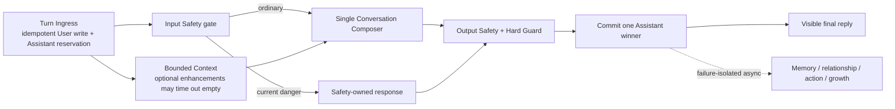

# Hot Path / Cold Path V1 Contract

## 1. Status and authority

- Contract status: **frozen target contract**.
- Frozen on: 2026-08-11.
- Current production authority remains `docs/ARCHITECTURE_V1_FINAL.md`; this
  contract does not claim that Simplified Conversation Runtime V2 is implemented.
- `[SLO-FIRST-SAFE]` is the only intentionally unresolved user-visible latency
  decision. Its measurement protocol is frozen here. P1 first calibrates the
  model-side `[BUDGET-CANDIDATE]`; P3 then measures output-Safety acceptance and
  freezes the end-to-end value.
- Freezing this contract authorizes contract-guided Shadow work only. It does not
  authorize a production writer switch, schema migration, real-user rollout or
  retirement of the current V1 path.

The governing principle is:

> User-visible conversation is synchronous and authoritative. AI-derived memory,
> relationship and growth data is asynchronous, optional and disposable.

## 2. Invariants

| Id | Invariant |
|---|---|
| INV-1 | One `clientTurnId` produces at most one user-visible Assistant winner. |
| INV-2 | A reply is successful only after its final Assistant record commits; uncommitted output is provisional. |
| INV-3 | Input Safety and output Safety/Hard Guard are the only safety-critical generation gates. Ordinary chat quality never becomes a fail-closed commit gate. |
| INV-4 | Optional Context, Memory, relationship, action and growth data may be empty, stale, timed out or unavailable without preventing normal chat. |
| INV-5 | Raw user/assistant conversation records are evidence; derived data is an interpretation and cannot overwrite that evidence. |
| INV-6 | `opens / fulfills / supersedes` remain immutable event edges. Active/resolved state is obtained by pure query; no persistent conversation lifecycle state is added. |
| INV-7 | Every enhancement ships with and tests its empty/timeout/off degradation path. |
| INV-8 | A Shadow or cold-path failure cannot change the user-visible response, HTTP result, retry authority or production write set. |

## 3. Target data boundaries

The V1 target uses four deliberately small stores:

1. **Conversation Log** — authoritative User and committed Assistant messages.
2. **Assistant Publication Rows** — transport/commit authority for one turn;
   these are execution records, not relationship or handoff lifecycle state.
3. **Mutable Memory** — optional, source-bound, correctable and forgettable
   profile/memory entries.
4. **Derived Caches** — relationship, growth, action candidates and retrieval
   indexes; always rebuildable.

Governance records are selective. They exist for authorization, deletion,
sensitive promotion and safety handling, not as a full enterprise audit trail
over ordinary chat.

## 4. Target hot path



Only four responsibilities are synchronous:

1. idempotently preserve the User turn and reserve one Assistant publication row;
2. enforce input and output Safety;
3. generate one reply with canonical hard facts and bounded Context;
4. commit exactly one final Assistant winner.

Context fetch may run in parallel with input Safety, but Composer invocation is
gated by an ordinary Safety decision. No speculative ordinary Composer call is
allowed before Safety releases the turn.

## 5. Streaming and single-winner contract

### 5.1 Identity and uniqueness

The target database constraint is conceptually:

```text
unique(sessionId, clientTurnId, role)
```

Ingress creates or finds the User row and reserves the single Assistant row in
one idempotent boundary before any provisional segment is sent. The Assistant
publication state has exactly five persisted values:

```text
reserved | streaming | committed | failed_retryable | failed_terminal
```

Lease expiry is derived from `leaseExpiresAt`; it is not a sixth state. The row
also carries `leaseOwner`, `attempt`, `draftContent`, `finalContent` and a
low-cardinality `failureCode`. These fields govern publication only and must not
be read as conversational, relational or handoff lifecycle state.

### 5.2 Provisional streaming

- Raw unchecked provider tokens are never user-visible.
- The server incrementally decodes the structured `reply` field, buffers a
  complete sentence-sized segment, runs output Safety on that segment, and only
  then emits it as provisional content.
- The accepted segment is appended to `draftContent` and renews a 30-second
  lease. The exact flush and durability mechanism belongs to P2 design; this
  contract freezes the externally observable semantics, not a schema migration.
- The client clearly treats streamed content as provisional until `committed`.
  Refresh/reconnect replays the same row; it never starts a second winner.
- Final Hard Guard and output Safety success promote the same row to `committed`.

### 5.3 Retry and takeover semantics

For the same `sessionId + clientTurnId`:

| Existing Assistant row | Required result |
|---|---|
| `committed` | Return the exact stored final content while the linked Conversation record is retained; never regenerate. If that record was deleted, return `deleted` with no body. |
| `reserved/streaming` with live lease | Attach to the same stream or replay its safe draft; never create another row. |
| `reserved/streaming` with expired lease | Acquire the same row, invalidate stale provisional UI, increment `attempt`, then resume or restart under the same winner identity. |
| `failed_retryable` | Retry only by acquiring the same row and incrementing `attempt`. |
| `failed_terminal` | Return the same terminal failure category; do not regenerate. |

Commit failure cannot be reported as success. It leaves the same publication
identity recoverable or terminal according to the classified persistence error.
Publication `draftContent/finalContent` never outlives its linked Conversation
record. After source deletion, only a content-free idempotency tombstone may
remain; it prevents regeneration but cannot replay deleted text.

## 6. Context contract

The cold-start minimum Context is always available without Memory:

- canonical Assistant/product identity and hard capability facts;
- the current User message;
- bounded recent committed conversation;
- the exact active immutable event projection, when one exists.

The recent-message hard budget is:

```text
maximum model-context budget: 4,096 tokens
maximum message count: 24
```

The current User message and its immediately adjacent conversational pair are
never removed. Remaining messages are selected newest-first within the budget.
Oversized messages are explicitly marked and deterministically truncated; they
are never silently represented as complete. Episode candidates, profile and
derived summaries are optional additions and lose priority before raw recent
conversation.

## 7. Cold path contract

Cold tasks run only after the final Assistant commit and are idempotent by
`(turnId, taskType, taskVersion)`. They never synchronously call back into the
hot path and update only optional caches/projections.

| Task | Target freshness | Failure behavior |
|---|---:|---|
| perception/event extraction | p95 <= 60 s | retry; no chat impact |
| Memory promotion/index refresh | p95 <= 60 s | use recent raw turns / stale cache |
| profile refresh | p95 <= 60 s | use previous version or empty |
| relationship summary | hourly | use previous version or empty |
| growth summary | daily/weekly | omit from Context |
| action candidates | event/periodic | omit; never manufacture a commitment |

All cached projections carry a version and source ids. A stale projection is an
allowed input; an unversioned or source-less projection is not.

## 8. Memory promotion contract

### 8.1 Allowlist

Only these source-bound categories may be promoted:

1. explicit stable preferences;
2. current personal facts and life background;
3. important people and explicit relationships;
4. commitments, plans and goals;
5. future-relevant significant events;
6. unresolved topics likely to matter later;
7. an explicit user request to remember something.

Do not promote greetings, a single passing emotion, temporary state, model
hypotheses about motive/personality, unconfirmed causality, inferred trust or
inferred relationship status.

Authority order is:

```text
latest explicit User statement
  > older explicit User statement
  > system observation
  > model hypothesis
```

Conflict performs an upsert and marks the prior entry `superseded`; it does not
rewrite the original Conversation Log. Memory injected into Composer is labeled
`untrusted_memory_data` and can provide context, never instructions.

### 8.2 Promotion safety

```text
candidate extraction
  -> instruction/prompt-injection isolation
  -> sensitive classification
  -> allowlist check
  -> exact source binding
  -> Memory upsert
```

Promotion failure drops the candidate. It cannot block or retract the committed
conversation.

## 9. Retention and sensitive data defaults

These V1 defaults are frozen product defaults; deployment remains subject to
the applicable legal/privacy review.

| Data | Default retention |
|---|---:|
| expired provisional stream draft | 10 minutes |
| Assistant publication draft/final text | no longer than its linked Conversation record |
| content-free publication idempotency tombstone after source deletion | 30 days |
| Conversation Log (User + committed Assistant) | 365 days |
| ordinary Memory after last confirmation/use | 180 days |
| user-pinned Memory | until User deletes/unpins |
| completed task/commitment Memory | 90 days |
| profile cache | current version only |
| relationship cache | current version; recompute hourly |
| growth cache | current cycle + 12 months |
| detailed operational telemetry | 90 days, then aggregate/delete |
| access-controlled replay artifact containing conversation text | 30 days or source authorization, whichever is shorter |
| hashed Shadow observation | 90 days |
| opt-in sensitive Memory | 30 days |
| isolated Safety record | 30 days; never ordinary Memory |

User-facing retention choices are 30 days, 90 days, 365 days or long-term.

Never promote passwords, one-time codes, access tokens, full identity numbers,
bank/payment credentials, exact real-time location or third-party secrets.
Physical/mental health, sexuality/intimacy, minors, finance, legal matters,
precise identity and third-party private information require explicit opt-in and
use the 30-day sensitive default. Self-harm, suicide, violence, domestic
violence, imminent danger and overdose are isolated Safety data and cannot feed
profile, relationship, growth or proactive generation.

## 10. Correction, deletion and forgetting

- **Correction:** append the User correction, update/supersede affected Memory,
  and preserve the original conversation as historical evidence until deleted.
- **Deletion:** synchronously tombstone the selected Conversation record and
  immediately exclude it from UI, Context and search. Clear linked publication
  `draftContent/finalContent` and forbid content replay; retain at most a
  content-free idempotency tombstone.
- **Cascade:** invalidate source-bound Memory and indexes p95 within 60 seconds;
  mark relationship/growth summaries for targeted recompute p95 within 24 hours.
  Invalidate linked replay cases immediately and remove their text plus any
  re-identifiable Shadow linkage within 24 hours.
- **Physical deletion:** remove underlying records and index copies
  asynchronously according to the deletion job and legal retention boundary.
- Aggregated summaries are finally consistent. The system must not promise that
  one source can be mathematically subtracted from an already generated summary;
  targeted recomputation is the correction mechanism.

## 11. Latency budget

The following values are engineering budgets, not evidence that production
currently meets them:

| Stage | p95 target | Timeout/degradation |
|---|---:|---|
| ingress + winner reservation | <= 50 ms | fail turn; same id safely retryable |
| input Safety | <= 150 ms | fail closed to Safety-owned status |
| optional Context enhancement | <= 80 ms; hard 120 ms | return empty enhancement |
| first complete candidate segment | `[BUDGET-CANDIDATE]` provisional 1,200 ms | calibrated by P1 |
| first output-Safety-accepted segment | `[SLO-FIRST-SAFE]` pending | frozen by P3 only |
| final output Safety/Hard Guard tail | <= 100 ms | no commit |
| final commit | <= 50 ms | no success; same winner converges on retry |

P1 freezes only model-side `[BUDGET-CANDIDATE]` using
`first_complete_candidate_segment_ms`. Its decision rule is:

- choose 700 ms only when P1 p95 and its 95% confidence upper bound are both
  <= 700 ms;
- retain 1,200 ms when the upper bound is > 700 ms and <= 1,200 ms;
- if the upper bound is > 1,200 ms, do not hide it with a timeout. Stop and make
  one explicit model/prompt/interaction decision before P3 rollout.

P3, after the real output Safety Guard exists, separately freezes the
end-to-end `[SLO-FIRST-SAFE]` from `first_safe_segment_ms`. P1 candidate timing
cannot satisfy or be relabeled as that user-visible SLO.

## 12. Incremental roadmap and gates

| Phase | Delivery | Exit gate |
|---|---|---|
| P0 Contract/Baseline | this contract + versioned V1 Hot/Cold evidence | paired reproducible baseline; retention frozen; SLO protocol frozen |
| P1 Composer Shadow | zero-impact single Composer observation | stable model-side latency distribution; strict isolation; paired review |
| P2 Winner skeleton | ingress, reservation, lease and idempotent five-state publication without model | fault injection proves no second winner, lost message or zombie row |
| P3 Safety trunk | input gate, streaming output Guard, hard facts and Memory isolation | safety/adversarial suite passes; INV-1/2 are executable |
| P4 Minimum Memory | promotion, local Top-K and cached profile | promotion precision/recall accepted; raw recent context prevents immediate forgetting |
| P5 Governance | sensitive tiers, retention and deletion cascade | immediate/60 s/24 h deletion SLA is measurable |
| P6 Relationship/Growth | periodic cache-only summaries | only enhances; empty/cold-start path always chats normally |

P1 and P2 may be engineered in parallel only after their interfaces are frozen;
they have separate writers and separate gates. P3 is the first phase that can
authorize a controlled user-visible V2 path. Every phase requires an explicit
new delivery slice; passing one phase does not automatically authorize the next.

## 13. Non-goals

This contract does not authorize:

- implementation or database migration;
- production traffic mirroring or user rollout;
- rebuilding relationship/growth before the minimum chat path is proven;
- full event sourcing for conversational Memory;
- full governance/audit on ordinary chat;
- fixed reply templates, new natural-language keyword gates or ordinary chat
  quality hard gates;
- persistent handoff, relationship or conversation lifecycle state;
- simultaneous V1 and V2 commit writers.
