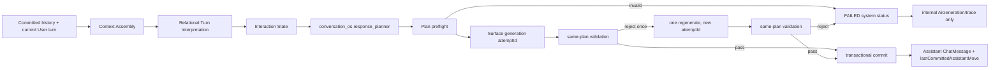

# Conversation OS Execution Boundary Audit

Status: frozen before execution-boundary behavior changes.

Date: 2026-07-24

## Scope

This audit extends, rather than replaces,
`conversation-os-relational-control-contract-audit.md`. The single ordinary
decision owner remains `conversation_os.response_planner`. Safety is the only
higher-priority response path.

## Reproduced P0 failure

The exact text shown in production was defined by
`services/ai/responsePlanValidator.ts` as
`RESPONSE_PLAN_CONSTRAINT_FAILURE_REPLY`.

Before this migration the failure propagated as follows:

```text
ResponsePlan
→ first Surface generation
→ Output Validation rejects
→ second generation under the same plan
→ Output Validation rejects
→ validator replaces the candidate text with an internal constraint sentence
→ chatOrchestrationService returns finalSource=constraint_failure as ChatReplyResult
→ chatReplyService persists AiGeneration(status=GENERATED)
→ chatReplyService creates ChatMessage(role=ASSISTANT,status=SAVED)
→ API returns assistantMessage
→ UI renders an Assistant bubble
→ the next request reads the SAVED message into recentMessages
→ Context Assembly and Prompt History treat it as a committed Assistant move
→ raw memory is also created from the internal sentence
```

The provider-exception catch in `chatOrchestrationService` produced the same
internal sentence and followed the same persistence path. The failure trace also
expired current answer obligations even though no Assistant move had committed.

## Frozen pre-migration ownership and data flow

| Stage | Input | Output | Persistent | Authority | Confirmed pre-migration defect |
|---|---|---|---:|---|---|
| Response Planner | relational Interaction State | one ResponsePlan | no | only ordinary decision owner | none in this P0 path |
| Plan preflight | ResponsePlan | absent | no | constraint only | no explicit preflight existed |
| Surface generator | plan + minimal relevant context | raw candidate | generation row later | realization only | provider errors were converted to dialogue text |
| Output validator | same plan + candidate | pass/fail | trace later | constraint only | authored an internal user-visible sentence after two failures |
| Orchestration | attempts + validation | ChatReplyResult | no | execution coordinator | represented FAILED as an ordinary reply and expired obligations |
| Persistence | ChatReplyResult | AiGeneration + ChatMessage | yes | commit boundary | persisted failed candidates as SAVED Assistant messages |
| History query | all session messages | recentMessages | read | projection only | did not filter failed/blocked events |
| API | persisted result | assistantMessage | no | transport only | had no structured system-failure response type |
| UI | assistantMessage | Assistant bubble | guest cache | presentation only | technical failure was visually indistinguishable from dialogue |

## Pre-migration trace fields and gaps

The existing trace contained ResponsePlan, raw output, validation results and
`finalSource`, but did not have a unified execution identity or lifecycle:

- no requestId;
- conversationId and turnId were not carried through persistence;
- attempts had no attemptId;
- no explicit plan-preflight result;
- failure causes collapsed into `constraint_failure`;
- database write and commit result were absent;
- no distinction between VALIDATED and COMMITTED;
- state update was calculated before persistence.

After migration each generation attempt stores its exact Surface model messages,
raw output, model parameters/meta, validation, attemptId and the surrounding
execution trace internally. These prompt messages are trace data only and are
never projected into conversation content.

## Frozen lifecycle contract

```text
PLANNED
  → plan preflight
  → GENERATED(attemptId)
  → VALIDATED
  → COMMITTED

Rejected generation:
GENERATED → REJECTED → RETRYING(new attemptId) → GENERATED

Any stage may instead produce FAILED:
PLAN_INVALID | GENERATION_NONCONFORMANT | SAFETY_BLOCKED |
PROVIDER_ERROR | TIMEOUT | PERSISTENCE_ERROR
```

Only `VALIDATED → COMMITTED` may create an official Assistant Message or update
Interaction State. A failed/rejected candidate remains an internal generation
attempt. It cannot enter Prompt History, common ground, obligations,
`lastCommittedAssistantMove`, raw conversational memory, or an Assistant bubble.

Retry retains the same conversationId and turnId and receives a fresh attemptId.
Persistence idempotency is keyed by the source user turn so concurrent attempts can
produce at most one committed Assistant Message.

## Existing relational-control work retained

The following already-implemented changes are preserved:

- relational `contentMeaning`, `responseRelation`, `stateUpdate`, and multiple
  interpretations;
- common ground split into confirmed, hypothesized, and rejected;
- dynamic initiative ownership;
- turn-scoped Grounding disclosure;
- available Grounding facts as truth source rather than output list;
- one ordinary Response Planner;
- minimal Surface realization input;
- validator enforcement of the same plan without replanning.

The execution migration adds a commit boundary around those structures; it does
not add a second planner, a naturalness guard, a post-generation rewriter, a repair
template, or screenshot-derived production classification.

## Implemented architecture



`ChatMessage.replyToMessageId` is unique. Both the logged-in API and the guest
route keep one turn identity across retry; every model attempt has a separate
attempt identity. Logged-in user-turn creation also uses a client/server turn id
with a duplicate-safe insert.

The UI response union is now:

```text
status=committed
  userMessage + assistantMessage

status=failed
  userMessage + systemStatus
  (no assistantMessage)
```

The system status is rendered outside the message list and offers a retry action.
It is not cached as a guest Assistant message and is not stored as a logged-in
`ChatMessage`.

## Interaction State commit contract

`lastCommittedAssistantMove` is persisted on the committed Assistant message and
contains:

- purpose;
- claims with relevance provenance;
- hypotheses/assumptions (never promoted to confirmed);
- question or request;
- expected user contribution;
- user burden;
- source user turn;
- commit evidence.

Answer obligations now support open, answered, withdrawn, and expired states plus
an explicit close reason. Validation alone does not close them. The official
`response_committed` transition is produced only after the Assistant message
transaction succeeds. Failed executions retain the current open-loop ids and
record no Interaction State transition.

## History contract after migration

- database/UI/search/calendar/timeline/proactive-history queries exclude
  `MessageStatus.BLOCKED`;
- Prompt History accepts committed statuses only;
- committed User and Assistant event text is never removed because of wording,
  old Prompt version, low-information form, or template heuristics;
- blocked/non-conversation events are excluded without deleting their committed
  source User event;
- explicit `replyToMessageId` linkage preserves answered-turn structure;
- the server supplies up to 24 source events so the sanitizer can select the
  final 8 messages without first destroying a linked boundary;
- if an 8-message crop begins with a linked Assistant response, its source User
  turn is retained with it;
- persisted `interactionMetadata` is carried into Context Assembly, so the state
  reducer reads the last committed move rather than reconstructing a failed
  candidate.

The same bounded committed raw window is supplied to Planner context and Surface,
so Interaction State cannot replace wording, tone, reference or pragmatic
information in recent conversation events.

## Final interaction and Surface amendment

Common-ground propositions now carry `subject`, `speaker`, `sourceTurnId`,
`evidence`, and `epistemicStatus`. Recent committed User assertions are
reconstructed as event-grounded propositions; committed Assistant assumptions
remain hypotheses, while only explicitly sourced system truths can reconstruct
as confirmed.

The single Response Planner chooses `minimal`, `standard`, or `deep` planning
depth. Ordinary low-risk conversation receives a minimal action and hard
constraints; direct obligations receive standard structure; ambiguity, repair,
Clinical or safety evidence raises depth. Surface receives the recent committed
raw window and a depth-scoped plan projection, not full provenance/debug traces.

The existing ambiguous-pragmatics interpretation call was not expanded. Its
internal trace now records call justification, attempted/used state, exact
synthetic Prompt messages, model, latency, input/output tokens, raw output and
provider failure. These fields measure the cost and error path of the optional
evidence call and never become conversation content.

## Verification

`npm run check:chat-execution-lifecycle` verifies:

- plan preflight and zero dialogue content from validator failure;
- one same-plan regenerate maximum;
- provider/timeout/public-failure projection;
- all six structured failure codes;
- 20 blind linked-history exchanges;
- consecutive User and Assistant turns;
- blocked candidate exclusion;
- concurrent commit returning one Assistant message;
- committed interaction metadata and execution trace;
- failed generation producing zero Assistant messages;
- API/UI structured system-status contracts.

The final `npm run check:launch` passed on 2026-07-24, including the production
build, full Conversation OS/Clinical/Grounding/Memory checks, Prisma validation and
migration status. Existing non-blocking warnings remain: one unused Memory
projection helper and two miniapp prelaunch recognition warnings.

A local-only provider-failure injection targeted `http://127.0.0.1:9` and made no
external model call. The Guest API returned:

```json
{
  "status": "failed",
  "systemStatus": {
    "type": "system_status",
    "code": "PROVIDER_ERROR",
    "message": "回复服务暂时不可用，请重试。",
    "retryable": true
  }
}
```

No `assistantMessage` was present.

The local migration preserved the one historical internal-constraint message and
changed its status to `BLOCKED`; a read-only verification found one blocked row and
zero visible rows with that exact content.

## External-model status

No Qwen call was made during this migration. The previously authorized total was
already exhausted according to
`assistant-grounding-relevance-projection.md`: pre 2 + post 10 = 12 user turns.
Therefore a new real-Qwen post run requires fresh authorization and cannot be
replaced by the local failure injection or offline replay.
