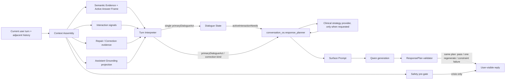

# Conversation OS Relational Control Contract Audit

Status: audit frozen before behavior changes; minimal migration implemented and verified.

Date: 2026-07-23

## Scope and invariants

This migration preserves the trace-proven History sanitizer, Grounding Projection,
turn-scoped disclosure, Safety pre-gate, and the single non-safety decision owner:
`conversation_os.response_planner`.

Screenshots and quoted conversations are regression samples only. They are not a
source for new production keywords, scenario branches, intent labels, repair
templates, fixed replies, a second planner, a naturalness guard, or a post-generation
rewriter.

## Final execution-boundary amendment

The completed migration keeps a bounded recent window of committed raw
conversation events beside the derived Interaction State. History projection no
longer removes committed text by wording, old Prompt version, low-information
form, or template heuristics. Earlier evidence may be summarized or retrieved,
but the recent raw window remains available to both planning context and Surface
Realization.

Every common-ground proposition now records `subject`, `speaker`,
`sourceTurnId`, `evidence`, and `epistemicStatus`. The reducer can reconstruct
recent user assertions, system-truth disclosures and Assistant hypotheses from
committed events plus `lastCommittedAssistantMove`; Assistant assumptions never
become confirmed solely because the Assistant committed them.

The only Response Planner now emits `planningDepth=minimal|standard|deep`.
Ordinary low-risk turns receive a minimal action contract; direct obligations
receive standard structure; ambiguity, repair, Clinical or safety evidence raises
the depth. Surface receives this depth-scoped projection and the recent committed
raw window, not full provenance, classifier traces, validator diagnostics, test
cases or complete Grounding.

Execution trace records `PLANNED`, `GENERATED`, `VALIDATED`, `REJECTED`,
`RETRYING`, `COMMITTED`, and `FAILED`. Only `VALIDATED → COMMITTED` creates an
Assistant conversation event or state transition.

## Current control graph



Observation: the graph has one formal Response Planner. However, the current-turn
literal/scenario classification already commits strategy before the Planner:

1. `turnInterpreter.primaryActFor` maps question form, `no_topic`, negative affect,
   correction, stop, and an advice pattern to one `primaryDialogueAct`.
2. `buildDialogueState` maps that label to `activeInteractionNeeds`.
3. `createResponsePlan` maps those needs, and also reads
   `primaryDialogueAct=yield_initiative` and
   `correction.stillOpenUserIntent=no_topic`, directly into response actions,
   question policy, tone, and length.

This is the earliest confirmed control-contract defect. It is not a second Planner,
but it makes a scenario label an implicit upstream planner.

## Current field inventory and authority

| Component | Current fields / outputs | Intended authority | Current effect on final ResponsePlan |
|---|---|---|---|
| Intent / Turn Interpretation | `literalMeaning`, `primaryDialogueAct`, `secondarySignals`, `directQuestions`, `interaction`, `repairSignal`, `correction`, `groundingReference`, `confidence`, `evidenceSources`, `notes` | Evidence and interpretation | **Direct control.** Primary/secondary labels determine needs and are read by Planner. |
| Semantic Evidence | `status`, `source`, `reason` | Meaning sufficiency evidence | Constraint evidence; also influences prohibited claims. |
| Active Answer Frame | `type`, `segment`, `question`, `answerKind`, `constraints`, `compatible` | Adjacent-turn answer compatibility evidence | Indirect control through semantic sufficiency/context; no direct action ownership. |
| Interaction signals | `contentAvailability`, `engagement`, `initiativeDirection`, `affect`, `stopIntent`, `evidence` | Evidence | **Direct control.** Values are projected into primary act, initiative, pause, question policy, and tone. |
| Repair / correction | `targetTurnId`, `correctionType`, `challengedPropositions`, `stillOpenUserIntent`, `evidence` | Evidence and state delta proposal | **Direct control.** Repair and `no_topic` fields select actions/question policy. |
| Assistant Grounding | `availableFacts`, `requiredDisclosure`, `prohibitedClaims`; identity, modalities, embodiment, capabilities | Truth boundary and relevant disclosure evidence | Required disclosure/prohibited claims constrain plan; full available facts are not sent to ordinary Surface. |
| Active Answer obligation | `id`, scoped conversation/turn ids, triggering act, target proposition, question kind, priority, required disclosure, evidence | State derived from an explicit current-turn question | Direct control: forces `answer_directly`, disclosure, and no follow-up for simple answers. |
| Clinical strategy advice | `strategy`, `intent`, `questionFunction`, `toneConstraints`, `interventionBoundaries`, `evidence` | Strategy service requested by Planner | Modifies plan only after Planner selects emotional/action support. It is not a decision owner. |
| Legacy Clinical plan | `responseGoal`, `responseIntent`, `primaryStrategy`, `secondaryStrategies`, `questionFunction`, `toneConstraint`, `interventionBoundary`, `safetyNotes`, `interaction`, `rationale` | Compatibility/non-production paths | Not an ordinary production ResponsePlan owner. Must remain non-authoritative. |
| ResponsePlan | obligations, disclosure scope, correction, actions, Grounding facts/disclosure, Clinical strategy, question/closure policy, tone, stance, length, prohibited claims, safety constraints, evidence | **Only non-safety decision authority** | Defines the complete ordinary response contract. |
| Surface Prompt | plan id/owner, obligations, disclosure, correction, actions, action surface contract, Grounding facts, Clinical advice, policies, tone/stance/length, surface form constraint, claims/safety, plan evidence | Realization only | Currently receives more explanatory and action-specific wording than the minimal contract requires. |
| Safety pre-gate | crisis classification and safety reply | Higher-priority safety authority | May bypass ordinary planning only for a triggered crisis. |
| ResponsePlan validator | obligation, question, closure, initiative, rejected proposition, Grounding truth, unsupported meaning checks | Enforce the same plan | May pass, regenerate once under the same plan, or return `constraint_failure`; does not replan. |
| Semantic Evidence guard | unsupported-meaning inspection contract | Compatibility constraint | Ordinary production uses its failure-reason collector; it does not author normal replies. |
| History sanitizer | role-pair-safe context filtering | Context projection | Changes available history, not the planned action. |
| Proactive greeting validator | greeting-only generation checks and deterministic fallback | Separate proactive-greeting boundary | Can alter proactive greeting output; it is outside ordinary user-turn ResponsePlan and must not leak into it. |

## Existing direct label-to-strategy conversions

The following conversions are frozen as migration targets, not endorsed as the new
contract:

| Source | Current conversion |
|---|---|
| `contentAvailability=no_topic` | `primaryDialogueAct=yield_initiative` |
| `affect=negative` | `primaryDialogueAct=seek_emotional_support` |
| repair signal | `primaryDialogueAct=correct_assistant` |
| advice-pattern match | `primaryDialogueAct=request_action_support` |
| question morphology | one question/identity/capability/definition/challenge act |
| `primaryDialogueAct` | one or more `activeInteractionNeeds` |
| `yield_initiative` or correction `stillOpenUserIntent=no_topic` | `take_light_topic_initiative` |
| repair need | `repair_previous_wording` and question suppression |
| emotional/action need | Clinical invocation and support action |

After migration, these classifiers may contribute evidence or candidate
interpretations. No single one may directly select a ResponseAction.

## Frozen old data contract

```text
TurnInterpretation
  literalMeaning
  primaryDialogueAct
  secondarySignals[]
  directQuestions[]
  interaction
  repairSignal / correction
  groundingReference
  confidence / evidenceSources / notes

DialogueState
  openLoops / answerObligations
  currentInitiative
  repairState
  correction
  conversationContinuity
  confirmedFacts / unconfirmedHypotheses
  activeInteractionNeeds[]

ResponsePlan
  responseActions[]
  questionPolicy / closurePolicy
  tone / stance / lengthGuidance
  grounding and clinical constraints
```

The structural weakness is the lossy
`current text -> single primary act -> need -> action` chain. It cannot represent
that one turn may simultaneously answer a previous move, reject a proposition,
continue a thread, and transfer initiative with different confidence levels.

## Frozen new relational contract

### Relational Turn Interpretation

```text
contentMeaning
  literalText
  semanticEvidence
  explicitPropositions[]
  directQuestions[]
  contentAvailabilityEvidence
  affectEvidence

responseRelation
  candidates[]
    relation
    confidence
    targetTurnId?
    evidence[]
  ambiguous

stateUpdate
  commonGround[]
    proposition
    operation = confirm | hypothesize | reject
    provenance
  obligationChanges[]
  initiativeProposal
  activeThreadProposal
  repairProposal

interpretations[]
  id
  contentMeaning
  responseRelation
  stateUpdate
  confidence
  evidence[]
```

Legacy `primaryDialogueAct` and `secondarySignals` may remain temporarily for trace
compatibility and evidence adapters. The state reducer and Response Planner must not
use them to select response strategy.

### Minimal Interaction State

```text
InteractionState
  currentActivity
    primary
    concurrent[]
    evidence[]
  activeThread
  commonGround
    confirmed[]
    hypothesized[]
    rejected[]
  openObligations[]
  initiativeOwner = user | assistant | shared | paused
  lastAssistantMove
  repairState
```

Every common-ground item carries proposition text/id, status, source turn, confidence,
and evidence provenance. Assistant hypotheses stay hypothesized until user evidence
confirms them. A user correction moves the targeted proposition to rejected and
prevents further disclosure or explanation of it.

`currentActivity` is a reduced conversational state, not an output action. The
Planner alone maps the updated state to response actions.

### ResponsePlan provenance

Every planned content-bearing element must include relevance provenance:

- each open answer obligation points to its current source turn;
- each required disclosure points to the question/obligation that requires it;
- each Grounding fact points to confirmed user or system truth;
- each response action points to the Interaction State transition that requires it.

The Surface layer receives only these relevant plan elements plus truth/safety
constraints. It does not receive classifier traces, alternate rejected scenarios,
full Assistant Grounding, full Memory, action-specific sample wording, or plan
evidence intended only for debugging.

## Migration sequence

1. Extend types with the relational interpretation and minimal Interaction State
   while preserving trace compatibility.
2. Produce multiple relation candidates from existing evidence only; add no new
   production keywords or screenshot-specific classifiers.
3. Reduce candidates and current context into Interaction State. Apply corrections
   as common-ground rejection and preserve unresolved obligations/thread state.
4. Make `conversation_os.response_planner` read only Interaction State and scoped
   obligations for action selection.
5. Add action/disclosure relevance provenance.
6. Minimize ordinary Surface input without changing Safety or adding a rewriter.
7. Prove state transitions with screenshot regressions plus unseen blind expressions
   and at least twenty counterexamples.

## Acceptance assertions

- Exactly one ordinary `conversation_os.response_planner` exists per generated turn.
- Every planned proposition/action has relevance provenance.
- Assistant hypotheses cannot enter confirmed common ground without user evidence.
- User denial withdraws the targeted premise and it is not re-explained.
- Initiative can move among user, assistant, shared, and paused from relational state.
- A response to the previous assistant move changes the next state and plan.
- Ambiguous turns retain multiple candidates instead of being forced into one intent.
- Unseen paraphrases pass without exact sentence matching.
- Safety remains the only higher-priority override.
- Validator output remains on the same ResponsePlan.

## Implemented state transition evidence

### Assistant invitation followed by no available topic

Before:

```text
contentAvailability=no_topic
-> primaryDialogueAct=yield_initiative
-> activeInteractionNeeds=ordinary_interaction
-> responseAction=take_light_topic_initiative
```

After:

```text
contentMeaning.literalText=<current user utterance>
responseRelation.candidates=[
  yields_initiative (0.91),
  continues_active_thread (0.68)
]
stateUpdate.initiativeProposal=assistant
InteractionState.currentActivity.primary=opening_thread
InteractionState.activeThread.status=active
ResponsePlan.responseActions=[take_light_topic_initiative]
ResponsePlan.relevanceProvenance=[
  responseAction:take_light_topic_initiative
    <- initiativeOwner + activeThread evidence
]
```

The legacy `primaryDialogueAct` remains visible only as compatibility evidence.
The Planner source contains no read of that field or of `contentAvailability`.

### User rejects an assistant proposition

Before:

```text
correction label
-> repair need
-> repair action
```

After:

```text
responseRelation includes repairs_previous_move
stateUpdate.commonGround includes operation=reject
InteractionState.commonGround.rejected includes targeted proposition
InteractionState.repairState.status=active
ResponsePlan.responseActions includes repair_previous_wording
ResponsePlan.prohibitedClaims forbids asserting/explaining the rejected proposition
```

If a prior user activity remains open, a separate `yields_initiative` relation
preserves that activity. The Planner sees `repairState + initiativeOwner`; it
does not read a correction scenario kind.

### Same text under different adjacent structures

| Adjacent structure | Relation/state result |
|---|---|
| Assistant has just invited a response | `yields_initiative`; owner `assistant`; activity `opening_thread` |
| Assistant has asked repeated questions | `shares_initiative`; owner `shared`; no new question |
| No adjacent assistant turn | new active thread plus assistant initiative when relational evidence yields it |
| An explicit prior pause remains active | `requests_pause`; owner `paused`; thread `paused` |

## Verification result

- `check:conversation-os-relational-state`: four context regressions, twenty
  unseen blind paraphrases, multiple interpretations, common-ground
  confirm/hypothesize/reject, provenance and no-bypass assertions passed.
- `check:conversation-os-control`: fifteen scenarios, complete adjacent-turn
  A/B runs and twenty counterexamples passed.
- `check:natural-chat-control`: four-turn trajectory and twenty-one
  counterexamples passed.
- `check:conversation-grounding-leak`: thirty-six counterexamples plus
  isolation/retry/concurrency/regeneration invariants passed.
- `check:assistant-grounding`: twenty scenarios and sixteen structural cases
  passed.
- `check:launch`: complete lint/audit/AI/Clinical/Semantic Evidence/
  Conversation/Memory/Prisma/miniapp/build chain passed. The only lint item is
  the pre-existing unused `createStubProjection` warning.

No external model call was made during this migration. Blind paraphrase tests
inject structured relational evidence at the interpreter boundary, so they
verify unseen-language handling without adding their text to production
classifiers.
