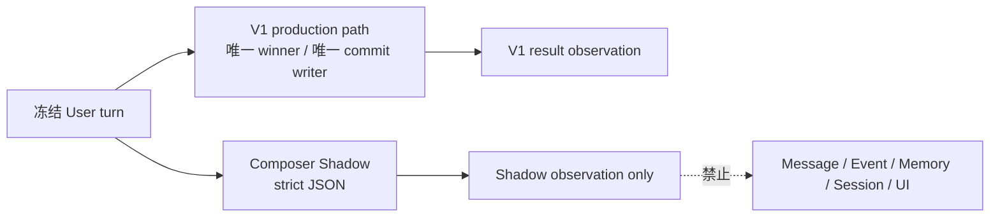

## Problem

Simplified Conversation Runtime V2 已提出用单一 Qwen Conversation Composer 取代普通回复链路中的 Interpretation、Dialogue State planning、ResponsePlan、Preflight、Surface 和普通聊天质量 Validators，但当前没有一份可比较的 V1 性能/失败基线，也没有冻结 Composer Shadow 的输入、隔离和观测合同。

如果直接开始 Shadow，实现很容易出现四类不可用证据：

1. 把进程首次启动、模型网络波动和普通热请求混在同一延迟分布里；
2. V1 与 Shadow 使用不同用户回合或不同历史，无法做 paired comparison；
3. Shadow 写入 conversation trace、事件边、Memory 或状态，暗中影响后续 V1；
4. 在样本、Prompt、模型或 schema 仍变化时提前宣称“更快”“更稳”或达到 SLO。

本切片只冻结 **P0 Hot/Cold V1 Baseline** 和 **P1 Composer Shadow V1** 的观测合同。它不实施 Shadow，不修改现有 V1，不设计 P2 winner/commit 代码，也不设定或声称任何已测 SLO。

## Evidence

- `docs/ARCHITECTURE_V1_FINAL.md` 的当前 V1 普通路径仍是 Context → Interpretation → Dialogue State → Helping → Response Planner → Preflight/一次 Planner recovery → Surface → Validation/一次 same-plan regeneration → State Update；Safety 是独立高优先级分支。
- 同一架构要求只有 validated winner 才可提交，Guest/Auth 保持逻辑同构，不可变 `opens / fulfills / supersedes` 边用于纯 active/resolved 查询，禁止持久 lifecycle state。
- `docs/tasks/simplified-conversation-runtime-v2-analysis.md` 已把目标普通路径收敛为 Safety、Turn Context Pack、Conversation Composer、Hard Boundary Guard、Single-winner Commit 五步，并明确 P1 应先 Shadow、零写入、V1 继续作为唯一 writer。
- `.project-team/ACTIVE_SLICE.md` 表明当前封存基线仍是 Plan Preflight Recovery；真实 Qwen 已证明 V1 可从一次 recoverable preflight failure 恢复并提交，但 Episode Retrieval 同次返回空候选。
- `.project-team/EVIDENCE.md` 记录：V1 有真实 `PLAN_INVALID`、`GENERATION_NONCONFORMANT`、first-contact repeated greeting、semantic false positive/negative 和 turn-scoped status 竞态历史；这些都必须在 P0 保留原样计数，不能由 Shadow 隐藏。
- `.project-team/REMAINING.md` 明确 Episode Retrieval 稳定性和 Safety 第三方转述仍未解决。P1 不得把这两项误记为 Composer 自身质量，也不得借 Shadow 修改它们。

## Root Cause

缺少的不是另一个模型实验，而是一个可复现、可配对、零影响的观测边界：

- **基线身份不清**：当前没有将 process-cold、process-hot、provider cold/unknown、idempotent replay 分开。
- **样本身份不清**：若每次运行都读取正在变化的会话，V1 与 Shadow 的差异可能只是上下文差异。
- **因果隔离不清**：若 Shadow 与 V1 并发争用请求预算，或写入 `AiGeneration.executionTrace`、Message、Memory、session/event metadata，开启 Shadow 本身就会改变 V1。
- **指标责任不清**：strict JSON 可靠性、延迟、普通聊天质量、硬事实正确性、Episode 使用和 Safety routing 属于不同指标，不能用一个总分代替。
- **退出语义不清**：P1 的职责是证明观测数据可用与 Shadow 零影响；是否授权 P2 winner 是后续产品/架构决策，不能由 P1 自动推出。

## Proposed Solution

### P0 — Hot/Cold V1 Baseline

P0 只运行当前 V1 production path，不创建 Composer，也不改变任何 retry、Validator、commit 或客户端状态行为。

#### 冻结样本单元

一个 `BaselineCaseV1` 是不可变输入快照，而不是指向持续变化会话的引用：

```text
caseId
sampleSetVersion
category
currentUserTurn
recentCommittedTurns
canonicalGroundingVersion
activeCommittedEventProjection | null
episodeCandidatesSnapshot[]
expectedSafetyOwnership: safety | ordinary
source: real_failure | positive_regression | adversarial
```

样本按不同风险类别覆盖，不用一个随机聊天集合代替：首次接触、回礼/寒暄、普通陪伴、主动探索、直接回答与身份、纠正/修复、停止/结束、无话题开放、active handoff、Episode 命中、Episode 空候选、普通 provider failure、Safety 当前危险、Safety 引用/第三方转述。Safety-owned 样本只进入 P0，不进入 P1 Composer。

每次运行从同一快照构造新的 session/turn identity；不得复用已提交 `turnId` 命中 idempotent winner，也不得让前一次输出成为下一次输入。`sampleSetVersion`、模型、Prompt、schema、代码 revision、环境和参数任一变化都必须生成新的 `runConfigHash`，不同 hash 的结果不得合并。

#### Cold 定义

`cold` 仅表示 **应用进程冷启动**：production-equivalent server/process 新启动后，在没有先执行聊天请求、没有命中进程内缓存或 in-flight dedupe 的情况下，执行该样本的第一个请求。

- 不清空数据库、操作系统 DNS/TLS 缓存或供应商缓存；这些不可控因素记录为 unknown，不冒充“模型冷启动”。
- build、migration、server boot 时间与 first request 分开记录；P0 的 `serverElapsedMs` 从 API 接收 turn 到产生 server result。
- 每个 cold observation 必须来自新的 process instance id；同一 process 的第二个请求不再标 cold。

#### Hot 定义

`hot` 表示同一 production-equivalent process 已完成健康检查和至少一个不计入样本的普通 warm-up request，随后用全新 session/turn identity执行冻结快照。

- 不得使用 HTTP/idempotency 缓存结果；必须真实执行 V1 链路。
- Hot 与 Cold 使用同一 `caseId + sampleSetVersion + runConfigHash`，形成 paired observations。
- Hot/Cold 分开报告，不合并成一个平均延迟。

#### P0 采集指标

P0 记录事实，不设置 SLO：

- 结果：`COMMITTED / SAFETY_BLOCKED / PLAN_INVALID / GENERATION_NONCONFORMANT / PROVIDER_ERROR / PERSISTENCE_ERROR`；
- `serverElapsedMs` 与已有可观测阶段时间；无法分段的阶段显式 `null`，不得估算；
- blocking Qwen call count、每类调用角色、attempt count、provider/model、token usage（provider 未返回则 `null`）；
- Planner attempts、Surface candidates、deterministic/semantic validation outcome、最终 winner 是否提交；
- Episode candidate count、Planner selected episode id 或 `null`；
- active handoff 输入与最终 immutable edge类型；
- User-visible server status 与 `retryable`；
- cold/hot、process id、revision、runConfigHash。

P0 不评价 Composer，也不把历史绿灯重述为本次测量结果。

### P1 — Composer Shadow V1

P1 只对 P0 中 `expectedSafetyOwnership=ordinary` 的冻结 turn 或 production 中已由 V1 Safety 判定为 ordinary 的抽样 turn 执行。Safety-owned、proactive-without-user-turn、idempotent replay、已有 winner replay 和 persistence retry 均不调用 Composer Shadow。



#### Shadow 输入合同

Composer 只能读取独立、递归冻结的 `ComposerShadowInputV1`：

```text
schemaVersion = composer_shadow_input_v1
shadowRunId
caseId | null
sampleSetVersion | null
conversationIdHash
turnId
currentUserText
recentCommittedTurns[]:
  messageId, role, text, replyToMessageId | null
assistantGrounding:
  canonicalFactId, value, epistemicStatus
activeEvent:
  sourceAssistantEventId, relation=open, purpose | null
episodeCandidates[]:
  episodeId, compactSummary, confirmedFacts[], hypotheses[],
  people[], topics[], sourceMessageIds[]
purposeContractVersion
```

输入不得包含 V1 的 Interpretation candidates、Dialogue State activities、Clinical advice、ResponsePlan、preflight reasons、Surface candidates、Validator verdict、winner text 或内部 failure label。这样 Shadow 测的是 V2 合并能力，而不是复述 V1 决策。

同一个 `inputHash` 必须覆盖全部字段并随 observation 保存。Context 组装失败、active event strict parse 失败或数据超过冻结 bound 时，记录 `not_invoked + reason`，不得静默删字段后调用。

#### Shadow 输出合同

Qwen 使用 exact-schema structured output：

```text
schemaVersion = composer_shadow_output_v1
turnId
purpose:
  first_contact | direct_answer | repair | respect_boundary |
  accompany | explore | proactive
reply
episodeRef: episodeId | null
groundingRefs: canonicalFactId[]
eventRef: sourceAssistantEventId | null
```

P1 允许一次仅针对 malformed/extra-key/binding-invalid 的结构修复；它属于 Shadow observation，不得触发 V1 重试。第一次与修复结果分别记录，最大 Composer calls 固定为 2。

#### 隔离合同

Shadow 必须同时满足：

1. **V1 优先**：V1 是唯一 user-visible writer，Shadow 结果不能改变 V1 Context、Planner、Surface、Validator、retry、status、HTTP code 或客户端 authority。
2. **写隔离**：不得创建/更新 `ChatMessage`、`AiGeneration` winner/judge、session、SemanticMemory/Version/Evidence、Interaction envelope 或任何 lifecycle 字段。
3. **时序隔离**：只在 V1 server result 已确定后通过 failure-isolated background task调用；Shadow timeout、异常、取消或进程退出不能延迟、回滚或改写 V1 result。
4. **事件隔离**：Shadow 的 `eventRef` 只做校验观察；不得写 `opens / fulfills / supersedes`，不得影响 pure active/resolved query。
5. **资源隔离**：独立 concurrency budget、timeout、provider call tag 和 feature flag；Shadow 达到预算时记录 `not_invoked=budget_exhausted`，不能挤占 V1 provider retry。
6. **数据隔离**：Observation 进入非权威 telemetry/eval sink；即使实现复用数据库，也必须是单独 diagnostics namespace，零生产读取者。不得塞进 committed generation trace 后再被 Context/Memory读取。
7. **故障隔离**：Shadow provider/parse/guard failure 只改变 observation status；不得制造用户错误 banner或 manual retry。

#### 采集 schema

`ComposerShadowObservationV1` 使用 append-only、低权限、非对话权威记录：

```text
observationId
schemaVersion
createdAt
environment
revision
runConfigHash
sampleSetVersion | null
caseId | null
cohortKey
processTemperature: cold | hot | production_unknown

conversationIdHash
turnIdHash
inputHash
inputByteSize
recentTurnCount
episodeCandidateCount
hasActiveEvent

v1:
  resultStatus
  committedWinnerHash | null
  failureCategory | null
  retryable
  blockingQwenCalls
  plannerAttempts
  surfaceCandidates
  serverElapsedMs
  episodeSelectedIdHash | null
  committedEdge: opens | fulfills | supersedes | null

shadow:
  eligibility: eligible | ineligible
  ineligibleReason | null
  invocationStatus: not_invoked | success | provider_failed | timed_out |
                    malformed | hard_binding_failed | cancelled
  model
  promptVersion
  calls
  repairUsed
  elapsedMs | null
  promptTokens | null
  completionTokens | null
  outputHash | null
  purpose | null
  replyLength | null
  episodeRefHash | null
  groundingRefIds[]
  eventRefHash | null
  schemaValid
  turnBindingValid
  groundingRefsValid
  episodeRefValid
  eventRefValid

qualityAnnotations:
  evaluatorVersion | null
  willingToReply | null
  selfUnderstandingIncrement | null
  autonomyPreserved | null
  unsupportedPsychologizing | null
  historicalCausalityOverstated | null
  notesCode[]
```

默认 observation 不保存明文 user/reply；配对人工验收使用访问受控的冻结 eval artifact，并用 `observationId` 关联。生产 telemetry 不收自由文本 `notes`，只收枚举 `notesCode`。

#### 指标口径

指标分开报告，禁止合成一个“Composer 分数”：

- **覆盖**：eligible、sampled、invoked、not-invoked reason；
- **结构可靠性**：首轮 strict JSON valid、repair 使用、最终 schema/binding valid；
- **性能事实**：Shadow elapsed/tokens/calls，P0 Hot/Cold V1 elapsed/tokens/calls；不据此宣称 SLO；
- **隔离**：Shadow on/off 时 V1 writer、result/status、committed edge 和 write set 是否完全一致；
- **硬边界观察**：turn、Grounding、Episode、event refs 的 exact validity；
- **产品体验**：冻结文本上的 paired blind review，分别记录愿意回复、自我理解增量、自主权、无依据心理化与历史因果升级；
- **记忆行为**：有候选时选择率、选择 id 是否有效、无候选时是否仍产生结构合法回复；不把 retrieval miss 算成 Composer miss；
- **稳定性**：同一 case 的结构/引用结果一致性与 reply 质量分歧率，不能只展示最佳一次。

### 样本选择与稳定性

- P0/P1 共用版本化分层样本；每类至少包含一个真实失败或真实正例和一个边界/对抗例，避免用大量相似寒暄稀释罕见失败。
- 冻结样本每个 case 在相同 `runConfigHash` 下独立运行三次；三次都保留，不挑最好结果。三次是稳定性观察单元，不是统计 SLO 证明。
- hard outcome（strict schema、turn/ref validity、write isolation）三次必须一致；任一次违规即该 case hard-unstable。
- 自然度/可聊性允许分歧，但必须报告分歧率和逐 case 配对结果；不得用平均分掩盖 repeated greeting、错误身份、强行因果等离散失败。
- Prompt、schema、模型、temperature、Context bound 或样本内容任一变化都升级版本并重跑完整稳定性单元；不同版本不得拼接。
- production sampling 使用稳定 hash cohort，而不是临时随机开关；同一 turn 最多一个 Shadow run，重复 delivery/retry 只记录已有 observation 或明确 dedupe reason。

### P0 / P1 退出门

**P0 complete** 只表示基线可用于比较，必须同时满足：

1. 冻结样本类别、快照、版本和 runConfigHash 完整；
2. 每个 case 有独立 Cold/Hot observations，且没有 idempotent replay 冒充真实执行；
3. 每个 observation 的 V1 result、调用次数、attempt、winner/edge、Episode 和可得 timing 字段齐全；不可得字段为显式 `null`；
4. 失败结果保留真实分类，没有被脚本转换成成功；
5. 报告只陈述测得分布，不提出未测 SLO。

**P1 complete** 只表示 Shadow 证据可审阅，必须同时满足：

1. 所有 sampled turn 100% 有 observation 或明确 `not_invoked` reason；
2. 零 Shadow conversation writes、零 event edges、零 Memory/session/lifecycle writes、零 user-visible status 影响；
3. V1 继续是唯一 writer，Shadow failure injection 不改变其 result authority；
4. 每个冻结 ordinary case 完成三次稳定性观察，hard outcome 无不一致；
5. exact input/output schema、hash、model/prompt/revision 和调用计数可追溯；
6. paired blind review 完成并逐 case展示，不用聚合平均隐藏离散失败；
7. Safety-owned cases保持 `ineligible`，Episode miss 与 Composer failure 分开计数；
8. 没有把 P1 结果写成“已达到 SLO”“已可上线”或自动授权 P2。

任一隔离违规立即停止 P1；它不是可以用质量收益抵消的指标。P1 complete 后只交付 evidence report，是否设计 P2 winner 必须另开切片并由用户授权。

## Files To Change

本分析阶段唯一新增文件：

- `docs/tasks/composer-shadow-v1-analysis.md`

本阶段不修改任何代码、现有合同、项目台账、schema、migration、Prompt、测试或运行配置。

未来若单独授权 P0/P1 实施，预期只允许新增/修改基线 runner、Composer Shadow adapter、非权威 telemetry sink 与对应检查；具体文件必须由 Developer 在实施前依据当前代码重新确认。本分析不批准 `chatOrchestrationService` 的 P2 winner 切换、V1 删除、commit/envelope writer 修改或生产 schema migration。

## Risks

- 当前工作树包含大量已封存与未封存改动；P0 若不记录 revision/runConfigHash，会把不同基线混为一组。
- 应用 process-cold 不等于 Qwen provider cold。把外部网络缓存解释成模型冷启动会产生错误结论。
- Shadow 虽然在 response 后运行，仍可能通过 CPU、连接池或 provider rate limit 间接影响 V1；必须独立并发预算并做 Shadow failure/load injection。
- 使用 V1 的计划或 Validator 结果作为 Composer 输入会人为提高 Shadow 一致性，却无法证明 V2 能独立取代它们。
- Observation 若进入现有 committed trace并被 Context、Memory或审计 loader读取，会形成隐性生产反馈环；必须保持零生产消费者。
- 三次重复只能识别明显不稳定，不足以证明总体 SLO；P1 不得据此声称生产可靠性。
- 人工评估若知道候选来自 V1 或 Composer，会引入偏差；必须盲化顺序并保留逐 case结果。
- Episode Retrieval 目前存在真实 miss；若不冻结候选快照，Composer memory-use 指标会被上游波动污染。
- Safety 第三方转述问题仍是独立 open gate；P1 跳过 Safety-owned turn，不得把普通 Composer 候选当作 Safety 修复证据。
- `purpose` 是 Shadow trace 字段，不得演化成持久 conversation mode 或 lifecycle state。
- P1 数据优秀也不等于 P2 可以上线；winner authority、Hard Boundary Guard、atomic commit 与回滚需要独立架构和验收。
