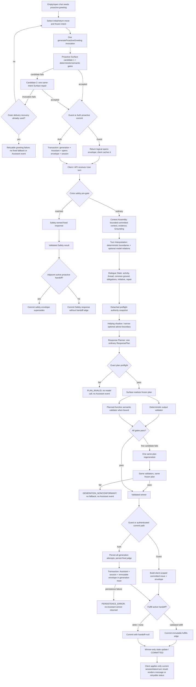

# Conversation Reply Logic Inventory & Conflict Review

状态：只读盘点，供逐条审阅；不构成实现批准、合同修改或修复方案。

基线：`codex/planner-handoff-migration`，HEAD `890a030ee6047aab7e8cf515aa837fd35f6ab8f0`（2026-08-08）。盘点日期：2026-08-10。

## 1. 全链路

普通回复的唯一计划链是：`Safety -> Context -> Interpretation -> DialogueState -> Response Planner -> preflight -> Surface -> deterministic + semantic validation -> at most one same-plan regeneration -> validated winner`。此后 Guest 走 client-scoped logical commit；Auth 先保存 generation/judge，再在事务中提交 Assistant、session 更新和 immutable envelope。二者不能互相作为持久化证据的替代。主动欢迎在普通 Planner 之外先提交一个 `opens` 事件；下一条 User turn 才进入普通 Planner。单次 `generateProactiveGreeting` 最多产生两个 Surface candidates；Guest 客户端与 Auth service 各允许一次外层 delivery recovery，因此一次打开/ensure 最多调用 generator 两次、最多出现四个 Surface candidates。Safety 是独立覆盖分支，不进入普通 Planner。

## 2. 证据等级、authority 与状态口径

| ID | 来源 | authority / date | 仓库状态 | 本盘点用法 |
|---|---|---|---|---|
| SRC-01 | `docs/ARCHITECTURE_V1_FINAL.md` | Architecture v1 current baseline；HEAD 最近提交 2026-08-05 | tracked，当前 dirty | HEAD 内容是已提交架构基线；dirty 新增段落只按工作树候选或台账封存状态引用，不能自动视为 HEAD 合同。 |
| SRC-02 | `docs/PRODUCT_ARCHITECTURE_V1.md` | Product Architecture；2026-07-11 | HEAD clean | 产品层级与早期定位证据；普通回复 owner 的旧表述受 SRC-01 的 2026-07-23 control closure 显式覆盖。 |
| SRC-03 | `docs/CONVERSATION_OS_V1.md` | Conversation OS Sprint 1；2026-07-11 | HEAD clean | 历史 Observe/Orient/Engage 设计；Engage 决策权不是现行生产 authority。 |
| SRC-04 | `docs/CONVERSATION_PURPOSE_CONTRACT_V1.md` | 用户确认冻结；2026-08-09 | untracked | 最新冻结产品目的合同，包含 `accompany/explore` 与首次欢迎三功能；尚未进入 HEAD。 |
| SRC-05 | `docs/CONVERSATION_OS_INTERACTION_MOVE_HANDOFF_CONTRACT_V1.md` | Conversation OS；freeze 2026-08-04，PHM-D/E 2026-08-05 | tracked，当前 dirty | HEAD 的 v1 handoff、PHM-A-E 是已提交合同；proactive v2/structured intent 等 dirty 增补按 `.project-team/EVIDENCE.md` 的封存记录单独标识。 |
| SRC-06 | `docs/CONVERSATION_OS_CONTROL_CLOSURE.md` | Conversation OS control closure；HEAD 最近提交 2026-08-04 | tracked，当前 dirty | HEAD 证明唯一 Planner、同 plan Validator、无普通 fallback；dirty 身份/主动欢迎/统一语义门段落按台账状态引用。 |
| SRC-07 | `docs/SAFETY_GOVERNANCE_LAYER.md` | Safety & Governance；2026-07-11 | HEAD clean | Safety 优先级、风险范围、产品边界与治理目标；部分是 roadmap，不等于当前运行时能力。 |
| SRC-08 | 当前实现 HEAD | HEAD `890a030`；2026-08-08 | committed | 生产已提交实现证据。 |
| SRC-09 | `.project-team/ACTIVE_SLICE.md`、`EVIDENCE.md`、`REMAINING.md` | 当前交付治理台账；2026-08-10 工作树 | dirty | 只用来区分“台账已封存”“未封存候选”“失败后停止”；不替代产品或架构合同。 |

本文状态标签：

- **HEAD/已提交**：可在 `890a030` 复现。
- **已封存、未 Git seal**：当前 dirty 实现，台账有专项、独立 Reviewer 与发布门封存证据，但尚未进入 HEAD。
- **未封存候选**：当前 dirty 行为仍有失败 gate、没有完成声明。
- **文档已冻结、实现缺失**：产品/架构要求成立，但当前类型、Planner 或 Validator 尚无对应 production contract。
- **历史/兼容**：仍可读或可测试，但不是生产决策 owner。

## 3. 逻辑总表

### 3.1 入口、Safety 与 Context

| ID | 责任层 | 触发输入 | 决策或输出 | 硬门 / 质量偏好 | 证据来源 | 实现状态 |
|---|---|---|---|---|---|---|
| ENT-01 | Guest Application / API | Guest 用户提交，携带 `turnId`、文本与 recent messages | 规范化 User turn；同一 Guest `turnId` 复用在途执行；失败后删除缓存允许重试 | 硬门：输入、turn id、执行状态；不是回复质量偏好 | `app/api/chat/guest/route.ts:153-268` | HEAD/已提交；Auth 入口另见 AUTH-01/02 |
| SAFE-01 | Safety | 当前 User 文本命中危机 regex，且未命中媒体/否定/明确过去安全排除 | `isCrisisInput=true`，直接选择 Safety 路径 | 硬门：覆盖所有普通 planning | `services/ai/chatSafety.ts:6-20`；SRC-07 | HEAD/已提交；当前 dirty 只重命名 Grounding 字段 |
| SAFE-02 | Safety / Orchestration | SAFE-01 命中 | 固定边界声明、现实支持与急救建议；Clinical、Helping、Context、Planner 全部跳过；execution 直接到 `VALIDATED` | 硬门：普通链路完全不运行 | `services/ai/chatOrchestrationService.ts:203-260`；`services/ai/chatSafety.ts:22-33`；SRC-01 §2.1 | HEAD/已提交 |
| SAFE-03 | Safety / Commit | Safety winner 前一事件是 unresolved proactive `opens` | Safety envelope 写 `supersedes`；没有 active handoff 则 envelope 可为 null | 硬门：只允许 exact adjacent active target；错误 metadata fail closed | `app/api/chat/guest/route.ts:197-234`；`conversation-os/interactionMoveEnvelope.ts:684-711,771-837`；SRC-05 PHM-E | HEAD/已提交 |
| SAFE-04 | Safety governance | 高危、隐私、医疗边界 | 文档要求规则 + LLM 双通道、Safety flag 隔离、trace 可见 | 文档目标；当前运行时不全是硬门 | SRC-07 High-Risk / MVP Acceptance | 部分实现：当前回复入口只见 regex 单通道；治理 roadmap 不应写成已实现 |
| CTX-01 | Conversation / Context Assembly | Safety 未触发；当前 User turn + recent messages | 取最近 6 个 User/Assistant 输入事件，保留 id、replyTo、status、promptVersion、committed move 和严格解析 envelope | 硬边界：bounded context；无决策权 | `conversation-os/control/contextAssembly.ts:13-47`；SRC-01 §2.2 | HEAD 基础 + dirty envelope 投影 |
| CTX-02 | Context evidence | 当前 User turn 与相邻消息 | 计算 semantic evidence、active answer frame、repair/correction、interaction evidence | 证据提供者；本身不选择回复 | `contextAssembly.ts:48-75`；SRC-01 §2.2、SRC-06 §3 | HEAD/已提交 |
| CTX-03 | Context / Handoff projection | 紧邻 committed Assistant event 含合法 proactive envelope，且未 resolved | 输出 active handoff target；malformed envelope 不修复、不从文字重建 | 硬门：strict parser + exact committed identity | `contextAssembly.ts:30-58`；`interactionMoveEnvelope.ts:397-540,797-837`；SRC-05 §4/§14 | HEAD v1；proactive v2 parser 为已封存、未 Git seal |
| CTX-04 | Context / Grounding | 所有普通 turn | 注入 Assistant Grounding；confirmed facts 与 hypotheses 分开 | 硬事实边界；Surface 只应接收相关投影 | `contextAssembly.ts:69-74`；SRC-01 §2.2/§5 | HEAD 基础；product/assistant identity 拆分为已封存、未 Git seal |
| CTX-05 | Orchestration / selective context | 无 direct question、无 yields/pause/repair relation | 才加载 selected Memory；`user_confirmed` 进入 confirmed，其他进入 hypothesis | 上下文选择硬边界；非回复 hard-fail | `chatOrchestrationService.ts:272-291`；SRC-01 §2.2 | HEAD/已提交 |

### 3.2 Interpretation、关系与 Dialogue State

| ID | 责任层 | 触发输入 | 决策或输出 | 硬门 / 质量偏好 | 证据来源 | 实现状态 |
|---|---|---|---|---|---|---|
| INT-01 | Turn Interpretation | 当前 User 文字 | regex 识别 clinician/AI/identity/assistant name、能力、definition、reason、other question | 确定性硬边界：生成 direct question evidence；不是最终 action | `conversation-os/control/turnInterpreter.ts:17-58` | HEAD 基础；assistant-name 拆分为已封存、未 Git seal |
| INT-02 | Turn Interpretation / Grounding relation | direct question + adjacent Assistant wording | 映射 `assistant_name/identity/body/...` Grounding reference；身体隐喻追问与普通能力问答分开 | 硬证据边界 | `turnInterpreter.ts:61-105` | HEAD 基础 + dirty identity/current-claim closure |
| INT-03 | Turn Interpretation | pause、correction、question、answer frame、advice、distress、initiative、adjacency | 生成多个 target-bound `responseRelation` candidates；保留 ambiguity | 证据解释；不写 ResponseAction | `turnInterpreter.ts:170-276`；SRC-01 §2.3 | HEAD/已提交；部分 exact-claim/current-authority 为已封存、未 Git seal |
| INT-04 | Turn Interpretation | deterministic evidence | 输出 `contentMeaning`、common-ground operations、obligation changes、initiative proposal、thread proposal、repair proposal | 结构证据；不提交 state | `turnInterpreter.ts:279-397`；SRC-01 §2.3 | HEAD/已提交 |
| INT-05 | Optional model interpretation | 确定性边界未完全拥有普通语用；外部 interpreter 可用 | 补充 relation/act；confidence < 0.55、错 target、缺/错 exact claim binding fail closed；确定性 question/stop/repair/no_topic/negative/action boundary 优先 | 混合：模型是质量增强；binding/threshold 是硬门 | `turnInterpreter.ts:453-720`；`services/ai/turnInterpretationAdapter.ts`；SRC-01 §2.3 | HEAD model enrichment；exact committed-claim current authority 为已封存、未 Git seal |
| INT-06 | User move relation projection | active proactive target + current relation candidates + current User exact text | 输出 `reciprocates/answers/continues/opens/challenges/rejects/boundary/unclear` 与 UTF-16 evidence spans | handoff 硬证据；不能从 punctuation/promptVersion 推断 | `conversation-os/control/interactionMoveHandoff.ts`；SRC-05 §6-§8 | HEAD v1；当前 specificity/reconciliation 有 sealed 与未封存改动并存，逐项以 SRC-09 为准 |
| STATE-01 | Dialogue State | direct questions | 为当前 `conversationId + turnId` 创建 `must_answer_first` obligations 和 required disclosure | Planner 硬输入；义务只属当前 turn | `conversation-os/control/dialogueState.ts:11-29,212-218`；SRC-01 §2.4 | HEAD 基础 + dirty `assistant_name` |
| STATE-02 | Dialogue State / Common Ground | committed user utterances、committed Assistant claims/assumptions、current updates、selected context | 形成 confirmed / hypothesized / rejected 三态；被拒命题从前两类撤出 | Grounding/evidence 硬约束 | `dialogueState.ts:31-158`；SRC-01 §2.4 | HEAD/已提交；dirty claim authority 增补 |
| STATE-03 | Dialogue State | relation candidates + obligations + initiative | 推导 concurrent activity：pause、idle、answering、repair、action/emotion support、opening/developing thread | Planner 结构输入 | `dialogueState.ts:160-210` | HEAD/已提交 |
| STATE-04 | Dialogue State | previous committed Assistant event | 保存/投影 last committed move、expected contribution、burden；legacy 无 metadata 时用 punctuation 兼容投影 | metadata 优先；legacy 投影是兼容路径 | `dialogueState.ts:219-283` | HEAD/已提交；兼容 punctuation 仍存在 |
| STATE-05 | Dialogue State | interpretation state update | 生成 initiative owner、active thread、repair state；只作为本轮 reconstructible state | 硬边界：不创建 handoff persistent lifecycle | `dialogueState.ts:226-312`；SRC-05 §12、§14.8 | HEAD/已提交 |

### 3.3 Planner、responsibility、posture 与 handoff

| ID | 责任层 | 触发输入 | 决策或输出 | 硬门 / 质量偏好 | 证据来源 | 实现状态 |
|---|---|---|---|---|---|---|
| PLAN-01 | Response Planner | Safety 未触发，Context + Interpretation + DialogueState 完成 | 每 turn 只创建一个 `ResponsePlan`，`decisionOwner=conversation_os.response_planner` | 架构硬不变量 | `chatOrchestrationService.ts:355-389`；`responsePlanner.ts:368-724`；SRC-01 §2.5 | HEAD/已提交 |
| PLAN-02 | Response Planner | pause / current obligation / repair / action support / emotional support / assistant initiative / ordinary exchange | 依优先级选 `respect_pause`、`answer_directly`、`explain_plainly`、repair、support、topic initiative 或 acknowledge | 硬计划决策 | `responsePlanner.ts:277-313` | HEAD 基础；current reciprocal fallback 是未封存候选 |
| PLAN-03 | Response Planner / obligations | 当前 open obligation | 必须先 direct answer；definition/reason 另加 plain explanation；简单直接回答默认 no follow-up | 硬责任 | `responsePlanner.ts:287-293,542-589`；SRC-04 §5 | HEAD/已提交；identity obligation dirty 扩展 |
| PLAN-04 | Response Planner / repair | repair state 或 typed handoff rejection | 选择 repair action 与 `factual_replacement / proposition_withdrawal / interaction_move_withdrawal` positive contract | 硬责任与 exact target | `responsePlanner.ts:128-219,250-275,472-504` | HEAD repair 基础；identity repair/current claim 细化为已封存、未 Git seal |
| PLAN-05 | Response Planner / identity | assistant-name question、identity question、exact adjacent committed identity `affirm`、product/name mix-up | 从 Grounding 产生 required disclosure；dirty 实现可生成 `establish_assistant_identity` continuation/repair contract | 硬事实责任 | SRC-04 §2/§6；`responsePlanner.ts:28-97,451-498,534-538` | 文档已冻结；continuation/repair 为已封存、未 Git seal；首次欢迎 identity 由 proactive path 而非 ordinary Planner 实现 |
| PLAN-06 | Response Planner / Clinical compatibility | activity 是 emotional/action support，且非 repair | 可请求 narrow Clinical advice；其他普通 turn `clinicalInvoked=false` | 策略输入；不能成为第二 plan owner | `chatOrchestrationService.ts:322-384`；`responsePlanner.ts:461-471`；SRC-01 §2.5 | HEAD/已提交；Helping full shadow 不进 Surface |
| PLAN-07 | Response Planner / initiative | `initiativeOwner=assistant`、无更高责任 | `take_light_topic_initiative`；问题策略通常 one low-pressure question | 硬 plan action；具体措辞是质量实现 | `responsePlanner.ts:296-304,544-589`；SRC-06 场景 A | HEAD/已提交 |
| PLAN-08 | Response Planner / idle | current turn 仅 acknowledge completed move、无 handoff/obligation/new content、state permits idle | 删除 topic initiative，保留 concise acknowledge，`closurePolicy=allow_idle` | 硬仲裁，防止 idle 与 initiative 同时存在 | `responsePlanner.ts:505-533,673-683`；SRC-04 §5 | 已封存、未 Git seal |
| PLAN-09 | Response Planner / question & closure | plan responsibilities、handoff tuple、pause、idle、answering previous question | 选择 `none / optional_after_answer / one_low_pressure_question` 与 `forbid_closure / allow_pause / allow_idle` | 计划硬约束，随后由 Validator 执行 | `responsePlanner.ts:570-589,645-684` | HEAD 基础 + dirty idle/identity |
| PLAN-10 | Response Planner / provenance | 所有 actions、disclosures、facts、handoff/obligations | 生成 planningDepth、scoped disclosure、relevance provenance、prohibited claims | preflight 硬证据；tone/length 是质量偏好 | `responsePlanner.ts:590-724`；SRC-01 §2.5 | HEAD/已提交；dirty identity provenance |
| POST-01 | Product purpose / ordinary posture | 每个普通非 Safety turn，在硬责任之后 | 必须只选择 `accompany` 或 `explore`；证据不足默认 accompany；不持久化 | 冻结产品责任，不是 wording preference | SRC-04 §2-§5 | 文档已冻结、实现缺失：`ResponsePlan`、Planner、Surface 和 Validator 均无 `accompany/explore` 字段或统一选择门 |
| POST-02 | Product purpose / accompany | 日常、轻聊、无内在材料、不愿深入、低证据 | 对当前内容作真实贡献；不能纯收件，也不能把找话题责任退回用户 | 产品 hard acceptance；当前只被若干 action/regex 部分覆盖 | SRC-04 §3.1/§8；`responsePlanValidator.ts:95-163,615-700` | 部分实现；没有 posture-level 完整合同 |
| POST-03 | Product purpose / explore | 用户主动表达感受、矛盾、模式、选择困难或明确想理解自己 | 反映/区分/连接/整理/呈现选择；问题非必需，最多一个低压力问题 | 产品 hard acceptance；自然度与理解增量需人工验收 | SRC-04 §3.2/§4/§7 | 文档已冻结、实现缺失；当前 emotional support/Clinical advice 不能等同 explore posture |
| HAND-01 | Handoff Planner | active target + exact current User relation projection | 校验 target/function/turn/evidence span 后才生成 tuple；invalid 返回 null | 硬门 | `conversation-os/control/interactionMoveHandoffPlanner.ts:290-379`；SRC-05 §14.2-§14.4 | HEAD/已提交 |
| HAND-02 | Handoff Planner | boundary、challenge/reject、current obligation、user content、answer、reciprocal、unclear | 优先映射 respect / repair / answer / continue / complete reciprocal / defer | 硬计划决策 | `interactionMoveHandoffPlanner.ts:21-80,241-287,331-378`；SRC-05 §14.3 | HEAD/已提交 |
| HAND-03 | Handoff Planner | multiple relation candidates | 兼容族 collapse；包含 `unclear` 或不兼容组合 defer | 硬 fail-closed | `interactionMoveHandoffPlanner.ts:241-287`；SRC-05 §14.4 | HEAD/已提交 |
| HAND-04 | Handoff contract | non-question greeting + `reciprocates_move` | tuple=`complete_reciprocal_contact / fulfill / optional_after_completion`；无需新 topic/question 完成交接 | 冻结 hard function；ordinary continuation 只有独立当前轮支持时才可选 | SRC-05 §14.3-§14.5；`interactionMoveHandoffPlanner.ts:69-77` | HEAD/已提交 |
| HAND-05 | Current reciprocal composition | HAND-04 后 actions 为空 | dirty Planner 强制加入 `take_light_topic_initiative` | 当前候选 hard plan action，但不是批准合同 | `responsePlanner.ts:423-432`；SRC-09 Guest First-Contact Duplicate / Remaining | **未封存候选**：两轮真实 repair 后仍失败；不得写成已批准行为 |
| HAND-06 | Detached preflight authority | Planner 前的 Context/Interpretation/State 与 Planner plan | 对 exact nullable handoff plan、obligations、provenance 进行 detached deep-frozen equality validation | 硬门；失败即 PLAN_INVALID | `chatOrchestrationService.ts:355-390`；SRC-05 PHM-B-AUTH；SRC-09 evidence | HEAD/已提交 |

### 3.4 Proactive greeting 与首次欢迎

| ID | 责任层 | 触发输入 | 决策或输出 | 硬门 / 质量偏好 | 证据来源 | 实现状态 |
|---|---|---|---|---|---|---|
| PRO-01 | Proactive selector | `kind=initial/return` + 最近 3 个 structured greetings | initial 选 `open_statement`；return 在 structured move history 中轮换 statement/greeting/question | move 是 hard intent；轮换是质量/频率策略 | `services/ai/proactiveGreeting.ts:142-182` | 已封存、未 Git seal |
| PRO-02 | First-contact product purpose | 真正首次空上下文 | 欢迎必须同时完成：小慢 + AI 自我介绍、随便聊/慢慢理清两种可能、低压力入口 | 冻结产品 hard acceptance，不是固定文案 | SRC-04 §6/§8 | 文档已冻结；当前 structured first-contact intent 已封存、未 Git seal |
| PRO-03 | Proactive intent | initial empty context | 固定 typed semantic proposition；return statement/question 先生成 strict structured intent | intent/binding 是硬门；可见 phrasing 是 Surface 质量 | `proactiveGreeting.ts:210-240,606-642`；dirty SRC-01 §4.4 | 已封存、未 Git seal |
| PRO-04 | Proactive Surface | frozen intent + bounded recent context | 生成 <=160 字候选；Surface 不能改 move/function/proposition/question | intent fidelity 硬门；自然表达质量偏好 | `proactiveGreeting.ts:372-424,644-703` | 已封存、未 Git seal |
| PRO-05 | Proactive deterministic validator | candidate + first-contact flag + last 3 greetings | 非空/长度、首次含“小慢”、不能把产品名当助手名、visible similarity < 0.72 | 硬门 | `proactiveGreeting.ts:644-680` | 已封存、未 Git seal |
| PRO-06 | Proactive semantic validator | frozen intent + candidate + structured history | strict exact JSON、exact candidate span；检查 fidelity、clarity、anchored point、自足、burden、Grounding、无矛盾 move/topic duplicate | 模型语义 hard gate；negative/uncertain/malformed/provider failure 都拒绝 | `proactiveGreeting.ts:425-604`；dirty SRC-05 §5 | 已封存、未 Git seal |
| PRO-07 | Proactive generator internal repair | 单次 `generateProactiveGreeting` 的第一个 Surface/semantic candidate 失败 | 在该次调用内冻结同一 intent，只允许一个 Surface repair，因此每次 generator invocation 最多两个 Surface candidates；第二个仍失败才抛 generation error | 硬失败边界；不代表整个 Guest/Auth delivery 只有两个 candidates | `proactiveGreeting.ts:644-708`；SRC-04 §5 | 已封存、未 Git seal |
| PRO-08 | Proactive envelope | accepted proactive candidate | 构造 strict v2 `opens` envelope，intent 与 purpose/claim/question/contribution/burden exact agreement | commit 硬门；malformed 不回退 v1 | `interactionMoveEnvelope.ts:18-47,214-284,397-605` | 已封存、未 Git seal；HEAD 只有 v1 proactive writer |
| PRO-09 | Guest greeting delivery | Guest 客户端初次/回访打开 chat | session reservation 去重；一次 HTTP/generator 失败后释放 reservation并允许一次外层 HTTP recovery；每个 HTTP 调用内部又有 PRO-07 的两个候选，因此最多四个 Surface candidates；最终显示“欢迎语暂时没生成”且仍可直接发消息 | delivery hard behavior；Guest 只提交到 client-scoped event/cache，不是 Auth DB 事务 | `app/chat/chat-client.tsx:554-635,780-803`；`app/api/chat/guest/greeting/route.ts:59-100` | 已封存、未 Git seal |
| PRO-10 | Auth proactive trigger / due decision | Auth messages GET/显式 retry；session latest committed message、跨会话该用户是否已有 committed message、idle time、force | GET 调用 ensure；无当前 session message 时按跨会话 committed evidence 选 initial/return；已有 greeting、未 idle 30 分钟或 force 2 秒 dedupe window 内返回 `not_due` | Auth 触发/频率硬边界；不得由 Guest local evidence替代 | `HEAD app/api/chat/sessions/[sessionId]/messages/route.ts:58-67`；`services/chat/proactiveGreetingService.ts:23-24,139-185,256-275` | HEAD 有 ensure trigger；structured initial/return 与显式 status 为已封存、未 Git seal |
| PRO-11 | Auth proactive context / dedupe | Auth recent committed session messages与 generation trace | 从 generation trace 读 structured envelope；最近 3 greetings 供 move/history，排除 greetings 后最近 6 条供 model；legacy promptVersion 仅兼容识别 | 上下文与 dedupe 硬边界 | `services/chat/proactiveGreetingService.ts:185-231` | 已封存、未 Git seal |
| PRO-12 | Auth proactive outer recovery | `generateProactiveGreeting` 整次调用失败，包括内部两个 candidates失败 | `generateWithOneRecovery` 最多调用 generator 两次；每次内部最多两个 candidates，所以 Auth ensure 最多四个 Surface candidates。第二次重新进入 generator，return structured intent 不保证与第一次相同；不能称为四次 same-intent repair | 外层 delivery hard boundary；无固定 welcome fallback | `services/chat/proactiveGreetingService.ts:233-254,256-283` | 已封存、未 Git seal |
| PRO-13 | Auth proactive persistence / failure | generator 成功并返回 accepted intent/candidate | 单事务创建 AiGeneration、Assistant Message、v2 `opens` envelope、写 generation executionTrace、更新 session；任一生成或事务异常最终返回 `retryable_failure`，不把失败包装成 intentional empty welcome | Auth 原子持久化硬门；与 Guest logical commit 不同 | `services/chat/proactiveGreetingService.ts:50-137,256-284` | v1 transaction在 HEAD；v2 envelope/status/recovery 为已封存、未 Git seal |

### 3.5 Surface、Validators、retry 与 failure

| ID | 责任层 | 触发输入 | 决策或输出 | 硬门 / 质量偏好 | 证据来源 | 实现状态 |
|---|---|---|---|---|---|---|
| SURF-01 | Surface | preflight-valid frozen ResponsePlan + bounded history | 只实现 actions、obligations、disclosure、facts；不得重解释、重规划或加入无 provenance 命题 | 架构硬边界；自然、简短、口语是质量偏好 | `services/ai/promptBuilder.ts:70-79,477-525`；SRC-01 §2.6 | HEAD/已提交；dirty identity wording |
| SURF-02 | Surface history | recent messages | 过滤 blocked/unsupported，最多 8 条，必要时保留 explicit reply pair；legacy proactive boundary可裁掉 greeting 之前内容 | 上下文硬边界 | `promptBuilder.ts:86-161`；SRC-01 §2.6 | HEAD/已提交 |
| SURF-03 | Surface action contracts | ResponseActions、positive contract、handoff tuple | 注入 action-specific semantic constraints、question/closure/tone/length | 计划约束是硬要求；具体自然实现是质量 | `promptBuilder.ts:164-208,328-466` | HEAD 基础 + dirty identity/reciprocal constraints |
| SURF-04 | Reciprocal Surface | `complete_reciprocal_contact` | dirty Prompt 要求跳过表层问候并做陈述式过渡；若 actions 非空再实现 action | 当前候选，不是冻结合同文字 | `promptBuilder.ts:172-180`；SRC-09 PHM-C Reciprocal Surface Calibration | **未封存候选**：两轮真实校准后出现 repeated-greeting false positive，已停止 |
| SURF-05 | Topic initiative Surface | `take_light_topic_initiative` | 要求 neutral、concrete、low-burden topic entry，不 reassurance/pause/positive healing frame | action hard intent；候选措辞质量 | `promptBuilder.ts:358-362` | HEAD/已提交；与 HAND-05 组合的真实实现仍失败 |
| VAL-PLAN-01 | Plan preflight | ResponsePlan + detached authority snapshot | exact 验证 plan ownership、handoff、obligations、provenance；失败不调用 Surface | 硬门 | `chatOrchestrationService.ts:386-463`；SRC-05 PHM-B-AUTH | HEAD/已提交 |
| VAL-DET-01 | Deterministic output validator | candidate + frozen plan | 所有 obligations 必须满足；question=none 禁止问号；最多 1 个问号；forbid closure 禁止命中收口短语 | 硬门 | `services/ai/responsePlanValidator.ts:725-805` | HEAD 基础；dirty identity gate |
| VAL-DET-02 | Grounding validator | candidate | 禁止身体、临床、真人、未经支持的视觉/听觉/接触 claim；被用户拒绝的 Grounding 命题不能重复 | 硬门 | `responsePlanValidator.ts:703-757,812-834` | HEAD 基础 + dirty assistant-name split |
| VAL-DET-03 | Ordinary acknowledge/handoff validator | acknowledge 或 ordinary handoff actions | 拒绝 unsupported evaluation、generic causal mechanism、bare receipt/presence/open door；校准必须一问，statement handoff 禁止问号 | 硬门 | `responsePlanValidator.ts:79-163` | HEAD/已提交 |
| VAL-DET-04 | Topic initiative validator | `take_light_topic_initiative` | 必须有问号或有限 initiative verb；拒绝把“聊什么”责任退回用户、reassurance/pause preface、positive/healing frame | 硬门 | `responsePlanValidator.ts:615-633,794-804` | HEAD/已提交 |
| VAL-DET-05 | Legacy proactive-response validator | `respond_to_proactive_greeting` compatibility action | 拒绝 empty receipt、generic closure/approval、bare echo、generic follow-up、未显式恢复的 pre-greeting stale content | 硬门；v1 structured handoff 不应依赖它 | `responsePlanValidator.ts:635-700`；SRC-05 legacy path | HEAD/已提交，兼容路径 |
| VAL-SEM-01 | Planned Function Semantic Validator | plan 有 `interactionMoveHandoffPlan` 或 `positiveFunctionContract` | 一次 strict `json_object` call，handoff 与 positive-function 独立 nullable verdict；两者同时存在取 AND | 模型 hard gate；无此 contract 时不调用 | `services/ai/plannedFunctionSemanticValidator.ts:318-405,421-588`；dirty SRC-01 §4.5 | 已封存、未 Git seal；文件当前 untracked |
| VAL-SEM-02 | Semantic schema/binding | semantic provider output | exact keys、planId、handoff/positive binding、UTF-16 evidence 必须 exact；uncertain/malformed/provider failure fail closed | 硬门 | `plannedFunctionSemanticValidator.ts:170-307,477-536` | 已封存、未 Git seal |
| VAL-SEM-03 | Semantic function | handoff/identity/emotional/repair contract | 必须 target addressed、exact function/action realized、无 contradictory move；defer 不得伪称完成 | 硬门 | `plannedFunctionSemanticValidator.ts:538-566` | 已封存、未 Git seal |
| VAL-SEM-04 | Semantic question policy | semantic question count + handoff order + independently supported ordinary action | no-question 必须 0；其他最多 1；handoff optional question 必须在 required function 后且 plan 独立授权 | 硬门；不依赖问号 | `plannedFunctionSemanticValidator.ts:408-414,568-580` | 已封存、未 Git seal |
| VAL-ENV-01 | Envelope parser | proposed committed metadata | strict schema/exact keys/cross-field/source/edge/self-target validation；malformed fail closed | commit/query 硬门 | `interactionMoveEnvelope.ts:188-540` | HEAD v1；v2 part 已封存、未 Git seal |
| RETRY-01 | Output enforcement | first candidate fails deterministic 或 semantic gate | deep clone + recursive freeze plan；给同-plan failure constraints，最多重生成一次 | 硬生命周期 | `responsePlanValidator.ts:1008-1117`；SRC-01 §2.7 | HEAD same-plan retry；统一 semantic 合并为已封存、未 Git seal |
| RETRY-02 | Output enforcement | second candidate仍失败 | 返回 internal `constraint_failure` / `GENERATION_NONCONFORMANT`；不提交 candidate，不创建普通 fallback chat goal | 硬失败边界 | `responsePlanValidator.ts:982-1006,1109-1116`；`chatOrchestrationService.ts:548-570` | HEAD/已提交 |
| FAIL-01 | Orchestration | plan preflight failure | `PLAN_INVALID`，model not called，open obligations/state 不变，retryable status | 硬失败边界 | `chatOrchestrationService.ts:390-463` | HEAD/已提交 |
| FAIL-02 | Orchestration | Surface/provider/validator exception | `constraint_failure`，`FAILED`，无 fallback、无 Assistant event、state 不变 | 硬失败边界 | `chatOrchestrationService.ts:600-706` | HEAD/已提交 |

### 3.6 Commit、envelope、pure lifecycle query 与客户端 winner/status

| ID | 责任层 | 触发输入 | 决策或输出 | 硬门 / 质量偏好 | 证据来源 | 实现状态 |
|---|---|---|---|---|---|---|
| COMMIT-01 | Guest API / client-scoped execution lifecycle | `reply.execution.phase=VALIDATED` | 生成 Guest Assistant id、committed move、envelope；标记 logical `COMMITTED` 后才返回 Assistant message | Guest winner-only 硬门；不证明 Auth DB transaction | `app/api/chat/guest/route.ts:179-263` | HEAD/已提交 |
| COMMIT-02 | Committed move projection | validated ResponsePlan + visible reply | 保存 purpose、scoped claims、question/request、expected contribution、burden、source turn、evidence | metadata contract；后续 Context authority | `interactionMoveEnvelope.ts:608-654` | HEAD/已提交 |
| COMMIT-03 | Handoff fulfillment | final execution/attempt/validation 与 frozen plan/turn exact 一致，completionIntent=fulfill | 写 immutable `fulfills` edge 和 realizedFunction；defer 写 null | 硬 commit gate | `interactionMoveEnvelope.ts:713-756`；SRC-05 PHM-D | HEAD/已提交 |
| COMMIT-04 | Safety supersession | Safety winner + exact active source | 写 immutable `supersedes` edge | 硬 commit gate | `interactionMoveEnvelope.ts:684-711`；SRC-05 PHM-E | HEAD/已提交 |
| QUERY-01 | Pure lifecycle query | caller-supplied committed envelopes | `handoffCompleted` / `handoffSuperseded` / `handoffResolved` 只读 strict parsed exact target | 硬 fail-closed query；不持久化状态 | `interactionMoveEnvelope.ts:758-788` | HEAD/已提交 |
| QUERY-02 | Pure active target query | committed event stream + source Assistant id + current User id | 仅 exact adjacent open、唯一 ids、未 blocked、未 resolved 时 active=true | 硬 fail-closed query；不写 aggregate | `interactionMoveEnvelope.ts:790-837` | HEAD/已提交 |
| AUTH-01 | Auth messages API / turn idempotency | `turnId`、`retryTurnId`、session/user、requested content | 只接受合法 id；retry 必须绑定既有 committed User；同 turn 不同 content 返回 409；若该 User turn 已有 committed reply，直接返回同一 Assistant 与 immutable envelope，不重新生成 | Auth hard idempotency / single-winner gate | `HEAD app/api/chat/sessions/[sessionId]/messages/route.ts:154-254` | HEAD/已提交 |
| AUTH-02 | Auth messages API / committed context | 新 turn 或 retry，source User event | 只读取该 source 之前最多 24 条 committed events，携带 committed move 与 generation-trace envelope；User message 用 `createMany(skipDuplicates)` 事务插入并复核 session/user/role/content | Auth context/turn identity 硬门；User event可先于 Assistant成功持久化 | `HEAD app/api/chat/sessions/[sessionId]/messages/route.ts:256-358` | HEAD/已提交 |
| AUTH-03 | Auth reply persistence / generations & judge | `createChatReply` 返回所有 attempts 与 execution phase | 每个 candidate都保存 AiGeneration；只有 validated 的最后 attempt标为 accepted，其余标 FAILED并用 `rewriteOfId` 串联；只有 validated final generation保存 judge | 持久化审计硬规则；保存 failed candidates不等于提交 Assistant | `HEAD services/ai/chatReplyService.ts:119-186,393-483` | HEAD/已提交 |
| AUTH-04 | Auth Assistant transaction / immutable envelope | validated execution、turn-matched reply、final generation | 事务内按 `replyToMessageId` 幂等创建单一 Assistant、更新 session、从 frozen validation evidence构造 response/safety envelope，并把 `COMMITTED` execution + envelope写回 AiGeneration trace；重复请求只读取既有 envelope，不重写 | Auth 原子 Assistant winner / immutable envelope hard gate | `HEAD services/ai/chatReplyService.ts:188-350` | HEAD/已提交 |
| AUTH-05 | Auth persistence failure | generation/judge保存、Assistant transaction或envelope构造抛错 | 返回 `PERSISTENCE_ERROR`、`retryable=true`、清除 result 中 `committedMessageId`，不向 API 返回 Assistant winner；Assistant/session/envelope本身由同一事务保护，但事务前已写的 generation/judge审计行可能保留 | Auth hard failure boundary；不能由 Guest logical commit证据概括 | `HEAD services/ai/chatReplyService.ts:467-557` | HEAD/已提交 |
| AUTH-06 | Auth API result | reviewed reply failed / committed | failure 返回已持久化 User message + systemStatus（HTTP 200）；success才返回 committed Assistant（HTTP 201） | Auth user-visible result hard split | `HEAD app/api/chat/sessions/[sessionId]/messages/route.ts:386-469` | HEAD/已提交 |
| CLIENT-01 | Client optimistic lifecycle | submit text + active session | 创建 stable client turn id、optimistic User 与 typing placeholder | UI 行为；turn id 是后续 authority hard key | `app/chat/chat-client.tsx:1074-1111` | 已封存、未 Git seal |
| CLIENT-02 | Client winner authority | session epoch + latest submitted turn + async result authority | 只允许 current session/latest turn result更新 execution status/error；旧失败不能覆盖新成功或切回后的 session | 客户端硬 winner 门 | `chat-client.tsx:716-778,1086-1097,1173-1312`；SRC-09 Chat Turn-scoped Execution Status | 已封存、未 Git seal |
| CLIENT-03 | Client result rendering | committed / failed / transport response | committed 替换 placeholder；failed 移除 placeholder并显示 user-safe execution status；transport只显示当前 authority error | 硬结果选择 + UI 状态 | `chat-client.tsx:1112-1313` | 已封存、未 Git seal |
| CLIENT-04 | Client retry | current retryable execution status 或 auth greeting status | 仅 latest-turn authority 可 retry；同 `turnId` 发起新 request；success清状态，failure保留新 status | 硬 retry authority | `chat-client.tsx:1316-1471` | 已封存、未 Git seal |
| CLIENT-05 | Client status priority | turn execution status 与 greeting status | 展示 `(executionStatus ?? greetingStatus)`；普通 turn failure优先于 greeting状态 | UI winner/status policy | `chat-client.tsx:1662-1669` | 已封存、未 Git seal |

## 4. 冲突矩阵

### 4.1 文档—文档冲突

| ID | 类型 | authority / date / status | 冲突观察 | 影响 | 审阅时需要确认的问题 |
|---|---|---|---|---|---|
| C-DD-01 | 文档—文档 | SRC-03 Conversation OS 2026-07-11（历史） vs SRC-01 Architecture current baseline（HEAD 2026-08-05） | 旧文档让 Engage 选择回应方式、体验目标与 QuestionStyle；现行架构明确 Response Planner 是唯一普通 decision owner，legacy Engage 无 production authority。 | 如果把两份都当现行，会出现双 plan owner。 | 是否正式把 SRC-03 的 Engage 决策段标为 historical/superseded。 |
| C-DD-02 | 文档—文档 | SRC-02 Product Architecture 2026-07-11 vs SRC-01 2026-07-23 control closure / 2026-08-05 HEAD | SRC-02 描述 Conversation OS 调 Clinical 获得策略、专业策略迁出 Conversation OS；SRC-01 则让 Conversation Planner 拥有所有普通 action，Clinical/Helping 只提供窄建议。 | owner 与普通/助人边界容易被误读。 | 以 SRC-01 的显式 supersession 为准后，SRC-02 哪些段落仍是产品层定义，哪些已历史化。 |
| C-DD-03 | 文档—文档 | SRC-04 Purpose 2026-08-09 frozen/untracked vs SRC-01 HEAD proactive greeting段 2026-08-05 | Purpose 要求首次欢迎同时介绍“小慢”+ AI、说明两种对话可能、给入口；SRC-01 HEAD 只冻结 greeting/open statement/light question 和低负担入口，没有首次三功能。dirty SRC-01 已补写，但未进 HEAD。 | 按 HEAD 文档实现会遗漏用户已冻结的自我介绍要求。 | 是否承认 SRC-04 是该主题最新 authority，并单独处理其未进 HEAD 状态。 |
| C-DD-04 | 文档—文档 | SRC-05 Handoff frozen 2026-08-04 vs SRC-04 Purpose 2026-08-09 | Handoff 明确 reciprocal completion 不需要新 topic/question，handoff function 可 stand alone；Purpose 的代表场景要求用户“你好”后自然接住并继续，且纯第二问候失败。二者可兼容于“非 topic 的自然过渡”，但没有共同冻结其正向可见语义。 | Surface 不知道“stand alone”如何同时不是纯收件/第二问候/收口。 | 产品是否要求 reciprocal winner 本身承担额外 ordinary posture function，还是 handoff completion 的自然过渡已足够。 |
| C-DD-05 | 文档—文档 | SRC-07 Safety 2026-07-11 vs SRC-04 Purpose 2026-08-09 | Safety/Product Architecture 使用“陪伴型心理教练 / AI 心理陪伴助手”；Purpose 冻结“小慢是 AI 聊天助手，不是心理医生，不承担诊断或治疗”。两者边界相近，但用户可见角色名不同。 | 首次自我介绍、Safety disclosure 与营销定位可能使用不同角色称谓。 | 哪个称谓是用户可见 canonical role，哪个只保留为产品类别描述。 |

### 4.2 文档—实现冲突

| ID | 类型 | authority / date / status | 冲突观察 | 影响 | 审阅时需要确认的问题 |
|---|---|---|---|---|---|
| C-DI-01 | 文档—实现 | SRC-04 frozen 2026-08-09 vs current runtime | 每个普通 turn 必选 `accompany/explore`；当前 `ResponsePlan` 无 posture 字段，Planner/Surface/Validator 也没有 posture-level contract。已有 actions 只能局部近似。 | 无法证明一轮只有一个主要姿态，也无法统一验收自我理解增量。 | POST-01 是否作为独立未实现产品合同记录，而不把现有 action 自动等同姿态。 |
| C-DI-02 | 文档—实现 | SRC-05 §14.3/14.5 frozen vs dirty unsealed HAND-05 | 合同说 reciprocal handoff 可 stand alone，ordinary continuation 需独立当前轮支持；dirty Planner 在 actions 为空时无条件加 `take_light_topic_initiative`。当前 User 只有“你好”时没有独立 topic evidence。 | 候选 plan 扩大了用户当前轮未授权的 ordinary action。 | HAND-05 是合同偏离、产品新决策，还是需要对“independent support”重新定义；本盘点不替代该决定。 |
| C-DI-03 | 文档—实现 | SRC-04 accompany / low burden、DEC-02 vs SRC-09 open gate | dirty Planner 加 topic initiative 后，真实 Surface 两次生成“今天想聊点什么”；当前 Validator 按词面规则拒绝，用户只见生成失败。DEC-02 已明确这类开放问句可以成立，不能仅凭词面判定为把责任退回 User。 | 当前 hard gate 可能拒绝产品允许的自然入口；首次回礼链路也没有稳定 winner。 | 保留为未封存失败证据；后续需判断回复整体是否形成可接入口，而不是继续把该短语本身列为禁用。 |
| C-DI-04 | 文档—实现 | SRC-05 reciprocal positive postcondition vs dirty SURF-04 / semantic gate | 两轮真实 Surface calibration 后，模型语义 Validator 对 exact repeated greeting 出现 false positive；静态同类反例又正确拒绝。 | model hard gate 在真实输入上不稳定，可能提交合同明确禁止的第二问候。 | 现有真实 false positive 是否阻止该 dirty Surface/Validator overlay 封存；SRC-09 已回答“阻止”。 |
| C-DI-05 | 文档—实现 | SRC-07 MVP “规则 + LLM 风险判断双通道” vs `chatSafety.ts` | 当前入口只看到 regex + exclusion；没有 LLM safety judge。 | Safety roadmap 的覆盖范围不能写成 production completed。 | SAFE-04 保持“部分实现/roadmap”，不要据文档声称双通道已上线。 |
| C-DI-06 | 文档—实现 | SRC-01 §2.6 “no action-specific sample wording / repair templates” vs current Prompt | Surface Prompt 含大量 action-specific instruction、部分示例短语与 repair regenerate instruction。它们多数是语义约束，但已接近 template/phrase authority。 | 可能把 Surface 质量约束变成短语偏置，并与“semantic not template”边界混淆。 | 逐条判断哪些是必要 semantic contract，哪些已成为文档禁止的 wording/template 输入。 |
| C-DI-07 | 文档—实现 | SRC-04 “不能依靠中文关键词表” vs deterministic classifiers/validators | direct question、repair subtype、obligation satisfaction、closure、Grounding 与多类 failure 大量依赖中文 regex/词表。Architecture 允许 stable deterministic boundaries，但 Purpose 禁止用关键词选择 posture。 | 如果 regex 被误用于 posture 或产品质量结论，会越权；即使只作 hard boundary，也存在误杀。 | 明确哪些 regex 只守硬事实/责任，哪些实际在替代 semantic/posture 判断。 |

### 4.3 未决产品决定

| ID | 类型 | authority / date / status | 未决点 | 当前证据 | 审阅时需要确认的问题 |
|---|---|---|---|---|---|
| C-PD-01 | 产品决定未定 | SRC-04 frozen purpose + SRC-05 frozen handoff + SRC-09 failed gate | 用户首次回礼“你好”后，winner 应是无 topic 的自然过渡、一个 Assistant 自带具体话头，还是别的 accompany function。 | 空 action 会诱发第二问候/open door；强制 topic initiative 又把责任退回 User。 | 只冻结一个可观察的正向功能，再进入实现；本盘点不选择答案。 |
| C-PD-02 | 产品决定未定 | SRC-04 POST-01 | `accompany/explore` 应进入 ResponsePlan 的硬结构、semantic gate，还是只做人工体验验收。 | 当前没有 runtime representation；单一 semantic gate 又不能替代真人体验。 | posture 的 machine-checkable 最小 contract 与人工验收边界是什么。 |
| C-PD-03 | 产品决定未定 | SRC-04 首次欢迎 + current proactive structured contract | 首次三功能是否由一个固定 semantic proposition、三个独立 positive functions，还是一个复合 intent 验收。 | 当前 dirty 实现用一个固定 typed proposition + semantic verdict；Purpose 明确不是固定文案。 | 复合 intent 的可变表达边界与硬功能拆分方式尚未由冻结合同规定。 |
| C-PD-04 | 产品决定未定 | SRC-04 human acceptance vs VAL-SEM model gate | model semantic validator 的 false reject/false accept 容忍度，以及真实模型校准未通过时是否允许 production fail closed。 | reciprocal 有真实 false positive；普通可接受回复也可能被 semantic uncertainty/provider failure拒绝。 | 哪类普通功能允许模型作为 hard commit gate，哪类只应作为质量诊断。 |
| C-PD-05 | 产品决定未定 | SRC-02/SRC-07 vs SRC-04 | 用户可见定位究竟是“AI聊天助手”“AI心理陪伴助手”还是“陪伴型心理教练”。 | Grounding 当前 dirty 配置用“小慢 / AI聊天助手”；旧文档仍保留心理教练称谓。 | 冻结一个用户可见 canonical self-description，并标注其他称谓的适用层。 |

## 5. 可能硬拒绝“普通但可接受回复”的现行规则

以下不是说规则必然错误，而是说明它们会把自然语言中的灰度变成 commit hard-fail；审阅时必须把“安全保守”与“误杀普通回复”分开。

| ID | hard-fail 规则 | 普通但可能可接受的反例 | 失败结果 | 证据与状态 |
|---|---|---|---|---|
| HF-01 | crisis regex 命中即跳过普通 Planner | 引用、假设、转述或未被 exclusion 完整覆盖的非当前风险表述 | 固定 Safety winner；普通回复不可生成 | `chatSafety.ts:6-20`；HEAD |
| HF-02 | definition obligation 只接受有限“意思是/指的是/是指/说的是/就是说/就是”结构 | “这个词的含义更接近……”可能清楚回答，但未命中 | `unanswered_obligation`，最多重试一次后失败 | `responsePlanValidator.ts:725-756`；HEAD |
| HF-03 | `questionPolicy=none` 只要出现 `?`/`？` 就拒绝 | 候选引用用户原问句、使用反问作陈述，或标点误用但没有新增索取 | `question_not_allowed_by_plan` | `responsePlanValidator.ts:765-769`；HEAD |
| HF-04 | `forbid_closure` 命中有限收口短语即拒绝 | 在上下文中合理的“可以先放在这里”但 Planner 没识别到用户 pause | `premature_closure` | `responsePlanValidator.ts:794-796`；HEAD |
| HF-05 | topic initiative 必须有问号或有限 verb，并拒绝“想聊什么”类表达 | 自然陈述式具体话头未含“我来/聊个/先从/起个头/说个/换个轻松” | `missing_light_topic_initiative` 或 `initiative_returned_to_user` | `responsePlanValidator.ts:797-804`；HEAD |
| HF-06 | acknowledge 中新增固定评价词即拒绝 | 用户描述普通日常后，助手自然说“听起来挺好”，即使没有心理化 | `ordinary_acknowledgement:unsupported_evaluation` | `responsePlanValidator.ts:79-118`；HEAD |
| HF-07 | ordinary handoff 的 bare receipt/presence/open-door regex | 某些短回礼在真实关系中可能足够，但没有 validator 认可的“新会话功能” | `ordinary_handoff:no_new_conversation_function` | `responsePlanValidator.ts:128-163`；HEAD |
| HF-08 | proactive legacy response 的 closure/approval/echo/follow-up/stale substring rules | 合理的简短认可，或旧新内容词面重合但不是错误恢复历史 | 对应 `proactive_greeting_response:*` | `responsePlanValidator.ts:635-700`；HEAD compatibility |
| HF-09 | Grounding regex 将一组身体/在场/感知表达视为 literal false claim | “我会抱着这个问题继续想”这类非身体比喻可能误命中宽 pattern | `assistant_grounding:*` | `responsePlanValidator.ts:820-830`；HEAD |
| HF-10 | planned-function verdict uncertain/malformed/provider failure 一律 fail closed | 候选本身自然完成了功能，但 judge 输出格式错、证据 span 错或服务不可用 | semantic failure，第二次仍失败则无 Assistant winner | `plannedFunctionSemanticValidator.ts:421-588`；已封存、未 Git seal |
| HF-11 | semantic function由模型判 target/function/contradiction；真实 false positive/negative 均可能发生 | 合同一致自然过渡可能被拒；exact repeated greeting 曾被错误接受 | 可接受回复 hard reject，或不可接受回复误提交 | SRC-09 reciprocal calibration；dirty gate 未完全校准 |
| HF-12 | proactive semantic clarity/anchored point/topic distinct 全是 hard gate | 清晰但诗性、含蓄的欢迎可能被 judge 认作 empty atmosphere | 单次 generator 两个 candidates均失败会触发外层 recovery；Guest/Auth 最多两次 generator、四个 Surface candidates后仍失败，无 fixed fallback | `proactiveGreeting.ts:425-708`；`services/chat/proactiveGreetingService.ts:233-254`；已封存、未 Git seal |
| HF-13 | envelope/parser/preflight exact equality | 可见回复自然且正确，但 metadata 多 key、binding 顺序/字段/plan provenance 不 exact | commit 前失败或 handoff edge 不成立 | `interactionMoveEnvelope.ts:188-540,713-756`；HEAD v1 + dirty v2 |
| HF-14 | 每个候选最多两次，同 plan；任一 deterministic 与 semantic failure取 OR | 第二个之后可能仍能自然修好，但系统不再尝试 | `GENERATION_NONCONFORMANT`，用户只见 retryable system status | `responsePlanValidator.ts:1008-1117`；HEAD/dirty merged gate |

## 6. 逐项审阅顺序（只做裁定，不做修复）

1. **R-01 Source authority**：先审 SRC-01 至 SRC-09，确认每份文档是 current、superseded、frozen-untracked、HEAD 还是 dirty ledger；未完成此步，不审具体回复。
2. **R-02 Safety boundary**：审 SAFE-01 至 SAFE-04，分别裁定当前 hard gate 与 roadmap，不把双通道愿景算作已实现。
3. **R-03 Context scope**：审 CTX-01 至 CTX-05，确认 bounded context、strict envelope、Grounding 与 selective evidence 没有 decision-owner 越权。
4. **R-04 Interpretation ownership**：审 INT-01 至 INT-06，确认 deterministic hard responsibilities、model relation 与 exact target binding 的边界。
5. **R-05 Dialogue State**：审 STATE-01 至 STATE-05，确认 obligations/common ground/initiative/repair 是 reconstructible state，handoff 没有持久 lifecycle。
6. **R-06 Product posture gap**：优先审 POST-01 至 POST-03，只裁定“冻结但未实现”是否准确；不要先用现有 actions 反向定义 posture。
7. **R-07 Ordinary Planner**：审 PLAN-01 至 PLAN-10，确认唯一 owner、硬责任优先、Clinical compatibility、initiative/idle/question/closure/provenance。
8. **R-08 Handoff contract**：审 HAND-01 至 HAND-04 与 HAND-06，先确认已冻结/HEAD tuple 与 preflight；最后单独审 HAND-05，保持“未封存候选”。
9. **R-09 First contact**：审 PRO-01 至 PRO-13，逐项区分 SRC-04 冻结三功能、generator 内部两候选、Guest/Auth 外层各一次 recovery、两条不同 commit 路径；不把未 Git seal 写成 HEAD。
10. **R-10 Surface boundary**：审 SURF-01 至 SURF-05，重点核对 Surface 是否重规划、是否使用 wording/template authority，以及 SURF-04 的失败证据。
11. **R-11 Validators**：依次审 VAL-PLAN、VAL-DET、VAL-SEM、VAL-ENV；每条同时判断“必须保护的硬责任”和“可能误杀普通自然表达”的边界。
12. **R-12 Retry/failure**：审 RETRY-01、RETRY-02、FAIL-01、FAIL-02，确认普通 User turn 是同 plan 最多一次重生成；不要把它与 proactive 的“两次 generator × 每次两 candidates”混为同一重试合同。
13. **R-13 Commit/lifecycle**：先审 Guest 的 COMMIT-01，再审 shared COMMIT-02 至 COMMIT-04、QUERY-01 至 QUERY-02，最后审 AUTH-01 至 AUTH-06；分别确认 client-scoped logical winner 与 Auth persisted transactional winner，不能用其中一条证明另一条。
14. **R-14 Client winner/status**：审 CLIENT-01 至 CLIENT-05，确认旧请求不能覆盖最新 turn/session，greeting 与 turn status 的优先级清楚。
15. **R-15 Conflict decisions**：按 C-DD -> C-DI -> C-PD 顺序逐条标记 `resolved / acknowledged / product decision required`；本轮不写修复动作。
16. **R-16 Hard-fail audit**：逐条审 HF-01 至 HF-14，记录每条是“必要保守”“可接受误杀风险”还是“已有真实反证”，不通过改 regex、放宽 Validator 或新增 fallback 来结束本次审阅。
17. **R-17 Freeze check**：最终只确认这份 inventory 是否完整、来源状态是否准确、冲突是否分类正确；不把本文件本身当作新产品合同。

## 7. 逐条裁定记录

| ID | 日期 | 已裁定内容 | 明确不等同于 | 尚未裁定 |
|---|---|---|---|---|
| DEC-01 | 2026-08-10 | 在打招呼后的开放阶段，小慢必须继续推进内容，使本轮产生用户可以自然接住的新增内容单位；只完成互相问候不足以结束本轮。若对话已接近结束，且用户表达结束、暂停或不想继续的意向，小慢应尊重该意向，不得为了满足“推进”而强行续话。 | 不等同于每一轮都必须推进；不等同于必须提问；也不等同于无条件启动一个新话题。 | “开放阶段”和“结束意向”的识别证据；什么类型的推进可成为 hard contract。 |
| DEC-02 | 2026-08-10 | 用户没有提供话题且对话仍开放时，小慢优先提供一个容易接住的内容入口，同时保留用户选择实际话题的权利。“想聊什么”本身允许出现，是否足够应结合整句与上下文判断。 | 不等同于小慢必须替用户决定具体话题；不等同于禁用开放问句；也不要求一定使用问句、固定范围或示例。 | “容易接住”的上下文判断标准，以及 Planner 与 Surface 各自的责任。 |
| DEC-03 | 2026-08-10 | Validator 发现候选回复未满足已确定的计划时，应在系统内部指出具体缺失或矛盾，让小慢依据同一计划重新表达；这种普通生成修正不应转交给用户操作“重新生成”。 | 不等同于 Validator 替 Planner 决定应该聊什么；Validator 说明的是既定计划哪里没有被实现，而不是创建新话题或新目标。 | 内部修正的次数与最终不可恢复失败如何呈现；哪些判断可以 hard-fail，哪些只应作为质量反馈。 |

DEC-01 对冲突表的影响：C-DD-04 中“handoff completion 是否可以单独成为最终可见回复”已裁定为否；它可以完成交接生命周期，但用户可见回复仍须包含内容推进。

DEC-02 对冲突表的影响：C-PD-01 的正向方向已确定为“提供容易接住的内容入口”，而不是无条件启动具体话题。“想聊什么”不再被视为天然错误；应评价整句和上下文是否真的让用户容易接住。HF-05 与当前 `initiative_returned_to_user` 词面 hard-fail 因此成为明确待审冲突。

DEC-03 对冲突表的影响：Validator 的角色已确定为“核对既定计划并提供内部修正反馈”，不是第二 Planner，也不是把修正责任交给用户。C-PD-04 中关于 hard gate 范围、误杀容忍度和最终失败呈现仍未解决。

### 7.1 Safety / failure implementation amendment（2026-08-10）

- SAFE-01 / HF-01：raw regex-only 已被“规范化 imminent 快通道 + 每回合 strict semantic triage”取代。`新闻/电影` 不再整句 blanket exclusion；引用、过去安全、否定和混合当前危险由结构化 currentness + exact evidence 判断。
- SAFE-02：Safety response 不再先给冷启动免责声明；代码按 overdose/self-harm、violence/domestic danger、current ideation 三类选择行动顺序，并直接显示中国大陆 `120 / 110 / 12356`。
- SAFE failure：malformed/provider failure 在边界内只修复一次，第二次为 `SAFETY_BLOCKED`，零 Assistant event、零普通 Planner、零持久 lifecycle state。
- FAIL-01 / HF-14：`PLAN_INVALID` 与耗尽 hard correction 的 `GENERATION_NONCONFORMANT` 仍 fail-closed，但 user-safe `retryable=false`，分别说明“内部方案不一致”和“已经尝试修正仍无法可靠完成”。provider/timeout/persistence 继续可重试。
- Subject-Ownership Closure 后真实 Qwen `qwen3.7-max` 合成对抗集 22/22 通过：当前危险/承接与混合引用风险路由 Safety，明确第三方、过去安全和否定放行，无归属引文/括注/blockquote/code/装饰标记保守 fail closed。
- 冻结状态已通过：deterministic bypass 只接受无主体标记、整条消息为已实施行动的输入；所有意图和 Unicode 标点/符号在破坏性规范化前进入 semantic triage。Independent Verifier 与 Safety/Privacy Reviewer 最终均 PASS，且没有增加说话人词表或持久状态。

## 8. 本次盘点结论边界

- 已覆盖用户输入、Safety、Context/evidence、Interpretation/relations、DialogueState、obligation/repair/identity/initiative/posture、proactive greeting、handoff、Surface、plan/deterministic/semantic/proactive/envelope Validators、retry/failure、Guest logical commit、Auth turn idempotency/context/generation/judge/transaction/persistence failure、commit envelope/pure lifecycle query、client winner/status。
- 当前最重要的状态区分是：SRC-04 是用户已冻结但 untracked 的产品目的；多个 proactive/identity/client 变化是台账已封存但尚未 Git seal；reciprocal `take_light_topic_initiative` 与相应 Surface calibration 是明确未封存、真实 gate 失败后停止的候选。
- 本文只记录了 DEC-01 至 DEC-03 三项用户裁定；尚未把它们转写为正式 contract，也没有修改 runtime 或提出修复方案。
