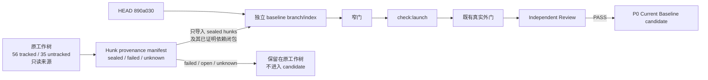

## Problem

当前分支基点是 `890a030`，但实际工作树包含 56 个 tracked changes 和 35 个 untracked paths。它们不是一个同质交付：同一批差异中同时存在已封存成果、真实 gate 失败后停止的候选、仍开放问题和没有足够证据判定的修改。直接把整个工作树作为 P0 baseline 会把失败或未知行为升级成当前权威；直接使用纯 HEAD 又会丢失已经通过专项、真实外门、完整发布门和 Independent Review 的成果。

M0 裁决 `D1=A` 已选择唯一方向：P0 Current Baseline 必须由 `HEAD 890a030 + sealed hunks` 组成。原工作树保持原样；failed/open/unknown hunks 不删除、不回退，只是不进入独立 baseline candidate。

本切片只设计如何构造和验收该候选树，不执行 Git 写操作、不修改运行时代码、不重新裁定产品或架构合同。

## Evidence

- `docs/tasks/conversation-reply-logic-inventory.md` 明确区分 `HEAD/已提交`、`已封存但未 Git seal`、`未封存候选`、`文档已冻结但实现缺失` 和 `历史/兼容`；dirty 文档或代码不能因为存在于工作树就自动成为当前合同。
- `.project-team/EVIDENCE.md` 和 `.project-team/REMAINING.md` 给出了可用于 baseline 筛选的结果边界：
  - sealed：Chat Turn-scoped Execution Authority、Proactive Move Structured Contract、PHM 已封存基础链、Plan Preflight Recovery、Conversation Episode Memory Loop、Hot/Cold 与 Composer Shadow 合同；
  - failed/open：Safety Semantic Triage 最终 Reviewer `FAIL`、Guest First-Contact Duplicate Runtime Boundary 停止、PHM-A Candidate Specificity / Reciprocal Surface open gate、PHM-C Reciprocal Surface Calibration failed real gate；
  - unknown：没有足够独立证据归属的 planned-validator/advisory hunks。
- 失败切片中存在“部分窄门通过但最终 gate 失败”的情况。局部绿灯不能覆盖最终 Reviewer `FAIL`，也不能允许将该切片的部分实现偷偷并入 baseline。
- 多个 sealed 与 failed slice 修改同一文件或相邻逻辑，例如 Planner、Prompt、Validator、Safety、proactive、handoff 和架构文档。因此筛选单位不能只是文件，必须是有来源证据的 hunk 或不可拆原子变更组。
- Episode Memory 同时涉及 schema migration、service、Planner/Surface integration 和 checks；PHM-D/E 同时涉及 validator authority、commit envelope 和 pure query。只取其中一半会产生依赖断裂，即使单个 hunk 看似属于 sealed slice。
- Hot/Cold / Composer Shadow 合同已经 Independent Review repair 后 `PASS`，但只授权 P0/P1 文档与后续独立实施，不授权 P2 winner、production writer switch 或 V1 retirement。

## Root Cause

当前问题的根因不是 Git 工作树“太脏”，而是交付证据没有自然映射为一个 Git commit 边界：

1. 多个切片连续在同一分支和工作树实施；
2. 同一文件同时承载 sealed、failed 和 unknown 修改；
3. 后续失败实验可能建立在早期 sealed hunk 上，普通 file-level add 无法区分；
4. 台账记录的是切片级结果，不是自动可执行的 hunk ownership manifest；
5. untracked 文件有的属于 sealed 新能力，有的属于 failed/unknown 实验，不能统一纳入；
6. 若在原工作树直接 reset、checkout、stash 或重新编辑，会破坏用户仍需保留的失败证据和未完成工作。

因此 P0 baseline 构造必须同时满足两项：以证据为准选择 sealed 变更，并在独立 branch/index 中验证其依赖闭包。任何无法证明归属或无法从 failed/unknown 依赖中拆出的修改，都不能由工程人员自行猜测取舍。

## Proposed Solution

唯一方案是建立一个独立的 **P0 Current Baseline candidate branch/index**，以 `890a030` 为父提交，按 hunk 或原子变更组只导入 sealed 内容；原脏工作树始终保持原状。



### 1. 冻结来源快照

开始未来实施前必须记录：

```text
sourceHead = 890a030ee6047aab7e8cf515aa837fd35f6ab8f0
sourceBranch
adjudicatedTrackedChangeCount = 56
adjudicatedUntrackedPathCount = 35
postAdjudicationPlanningArtifact = docs/tasks/p0-current-baseline-analysis.md
sourceStatusHash
sourceDiffHash
curationManifestVersion
```

`56 / 35` 是 M0 裁决时的来源快照；本分析文件是裁决后的唯一授权增量，因此创建后 untracked 计数自然增加一项。未来构造必须重新记录实际 status/hash，并显式把这份经复审的治理文档与 M0 来源快照区分。除本文件外若原工作树继续变化，停止当前 curation，生成新的来源版本；不得把两个时间点的 hunks 混在一个 candidate 中。

禁止在原工作树执行 reset、checkout、clean、stash-pop、批量格式化或任何会覆盖用户修改的操作。

### 2. 建立 hunk provenance manifest

每个候选 hunk 或不可拆原子组必须记录：

```text
path
hunkId / wholeNewFileId
sliceId
status: sealed | failed_open | unknown
evidenceRef
dependencyGroup
expectedGate
selection: include | exclude | stop
```

归类规则只有三条：

1. `sealed`：有明确冻结验收、最终 Independent Reviewer `PASS`，且该 slice 要求的发布/真实外门已经完成；可以进入依赖分析。
2. `failed_open`：最终 Reviewer `FAIL`、真实 gate failed、两轮 repair 后停止或台账明确 open；全部排除，即使其中部分局部门通过。
3. `unknown`：无法从证据唯一归属、缺少最终 Reviewer/外门、或 planned-validator/advisory 状态不清；全部排除并交由 PM 后续裁决。

禁止根据“代码看起来更好”“某项测试现在通过”或“另一个 sealed slice 也碰过同一文件”把 failed/unknown hunk改标 sealed。

### 3. 固定纳入与排除边界

候选纳入集合以台账状态为准：

- Chat Turn-scoped Execution Authority 的 sealed hunks；
- Proactive Move Structured Contract 的 sealed typed intent、strict output、Auth/Guest parity、winner/rollback 隔离 hunks；
- PHM 已封存基础：PHM-A reciprocal/unclear reconciliation、PHM-B + PHM-B-AUTH、PHM-C 已封存 Prompt/semantic baseline 与 structured-output reliability、PHM-D commit completion、PHM-E Safety supersedes/pure queries，以及 current-authority closure；
- Plan Preflight Recovery 的 exact 单原因、一次性、same-Planner recovery hunks；
- Conversation Episode Memory Loop 的 schema migration、service、request-lifecycle refresh、Planner selection 和专项 checks，作为一个依赖组；
- 已复审 `PASS` 的 Hot/Cold Path V1、Composer Shadow V1、Architecture V1 migration target 及其分析文档；
- 上述 sealed slice 为通过其冻结门所必需且证据可归属的 package script/check fixture hunks。

候选明确排除：

- Safety Semantic Triage & Failure Transparency 的全部 failed/open hunks；
- Guest First-Contact Duplicate Runtime Boundary 未完成 hunks；
- PHM-A Candidate Specificity / Planner Composition open hunks；
- PHM-C Reciprocal Surface Calibration failed real-gate hunks；
- planned-validator/advisory 中证据状态 unknown 的 hunks；
- 与上述 failed/unknown 实验同生但没有独立 sealed 证据的 Prompt、regex、threshold、fallback、状态或文档声明。

“排除”只表示不进入 P0 candidate，不表示删除、回滚或判定未来永远不用。

### 4. 独立 branch/index 构造

未来 Developer 应使用从 `890a030` 创建的独立 baseline branch 与独立工作树/index。原工作树只作为只读 hunk 来源：

1. baseline index 初始内容必须与 `890a030` tree 完全一致；
2. 按 manifest 将 sealed hunks或 whole-new-file 原子组应用到 candidate；
3. 每次应用后只查看 candidate diff，不修改来源工作树；
4. normal project index、来源工作树和 candidate index 不得复用；
5. candidate 中不允许出现未列入 manifest 的路径或 hunk；
6. 在所有 gate 通过前不移动现有生产分支、不删除来源 branch、不清理原脏树。

untracked 文件必须以 whole-file provenance 进入；若一个 untracked 文件同时包含 sealed 与 failed/unknown 逻辑，它不是天然原子文件，必须先证明能在 candidate 中按 hunk重建且保持合同。否则执行 Stop Condition。

### 5. 依赖闭包审查

在运行测试前先做静态依赖审查：

- import/export、type、schema、migration、package script、Prompt projection、validator binding、commit envelope、Auth/Guest调用必须闭合；
- sealed migration 与对应 schema/service/check必须原子纳入；
- immutable event edge writer、strict parser、pure query 和 commit authority不能只取一半；
- 一个 sealed hunk若依赖 excluded failed/unknown symbol、字段、Prompt或行为，不得临时复制、重写或把依赖改标 sealed；
- docs 中只能声称 candidate 实际包含且有证据通过的能力。

若依赖闭包只能通过纳入 failed/unknown hunk才能成立，立即停止，请 PM 在以下事项之间重新裁决：放弃该 sealed slice进入本次 baseline、重新授权一个依赖解耦切片，或重新判定相关变更状态。工程人员不得自行选择。

### 6. 验证顺序

候选树必须按以下顺序验收，前一层失败不运行后一层来掩盖：

1. **Manifest/diff audit**：candidate parent 是 exact `890a030`；candidate diff 中只有 manifest `include` 项；failed/open/unknown signatures 与文件均未混入。
2. **窄门**：按 dependency group 运行已经冻结的专项门，至少覆盖 turn authority、PHM envelope/planner/semantic/commit/pure query、proactive structured contract、plan recovery、Episode Memory 和 Hot/Cold docs checks。不得用一个总门替代具体失败定位。
3. **静态/构建门**：TypeScript、focused lint、migration/schema consistency、`git diff --check`。
4. **完整发布门**：`npm run check:launch`；只能在全部窄门通过后运行。
5. **既有真实外门**：只重跑 sealed slice 原本用于封存的真实 Qwen/数据库边界，不新增产品要求，不把 failed/open gate 改写成 baseline gate。真实外门的 provider、model、Prompt/schema version 与环境必须记录。
6. **Independent Review**：只读检查原目标、manifest归属、依赖闭包、failed/unknown排除、回归与不必要变更；Reviewer `PASS` 后 candidate 才可称为 P0 Current Baseline。

Episode Retrieval 的已知真实空候选继续记录为独立 Remaining，不得在本次通过增加关键词或改 Planner来修。Safety 第三方转述、Guest first-contact 与 reciprocal Surface failed gate也继续作为排除/Remaining证据，不要求 candidate 在本切片解决。

### 7. 完成与停止语义

本切片完成标准是：独立 candidate 可由 `890a030 + manifest` 重建；只含 sealed依赖闭包；窄门、静态/构建、launch、既有真实外门和 Independent Review 全部通过；原工作树逐字节保持不变。

立即停止并请求 PM 改判的情形：

- sealed 与 failed/unknown 修改位于同一不可安全拆分 hunk或同一不可拆新文件；
- 拆分后类型、schema、Prompt、validator、commit或测试依赖断裂；
- 修复依赖需要新增实现、重新设计或修改 sealed acceptance；
- 无法从台账证明 hunk ownership；
- 来源工作树在 curation 期间变化，导致 manifest/hash失效；
- candidate 窄门表明先前 sealed slice 实际依赖被排除实验；
- 真实外门或 Independent Reviewer 否定 candidate；
- 需要纳入 Safety、Guest first-contact、PHM-A specificity、PHM-C reciprocal Surface 或 planned-validator/advisory unknown修改才能让 launch 通过。

停止时只报告冲突 hunk、依赖边和受影响 sealed slice，给 PM 一个明确改判点；不得在 baseline curation 中开始修代码。

## Files To Change

本分析阶段唯一新增文件：

- `docs/tasks/p0-current-baseline-analysis.md`

本阶段不修改任何其他文档、代码、schema、migration、Prompt、测试、项目台账、Git index、branch 或工作树。

未来单独授权实施时，写入目标只能是独立 baseline branch/index。原工作树所有 tracked/untracked 修改保持原状；实际 candidate 文件清单必须由 hunk provenance manifest 和依赖闭包审查产生，不能由本分析预先把整个文件列入。

## Risks

- 台账是 slice-level 证据，不是 hunk-level provenance；把它机械映射到 diff可能误收后续失败实验或漏掉早期 sealed 基础。
- Git 的文本 hunk 边界不等于语义边界。相邻行可被拆开不代表类型、Prompt和Validator合同可独立成立。
- `responsePlanner.ts`、`promptBuilder.ts`、Validators、Safety、proactive service 和 Architecture 文档是高概率 mixed-hunk 区域；任何“顺手保留最新版本”都会违反 D1=A。
- untracked `plannedFunctionSemanticValidator.ts` 同时靠近 sealed structured-output/semantic成果与 unknown planned-validator状态；未完成逐 hunk/依赖归属前不得整体加入。
- Episode migration/schema/service若不作为依赖组，会产生迁移存在但运行时缺失，或代码依赖不存在 enum的候选树。
- `package.json` 和检查脚本包含多个 slice 的入口；整体纳入可能把 failed/open gate或未知脚本带入 baseline，整体排除又可能让sealed门不可运行。
- 排除 failed Safety hunks后，candidate 会恢复 HEAD Safety行为；这不表示 Safety 问题已解决，必须继续保留 open-risk说明。
- 一个干净 candidate 和全绿 `check:launch` 仍不能证明hunk归属正确；必须有manifest、真实外门和Independent Review三类独立证据。
- 原工作树在构造期间继续被其他任务修改会使 source hash漂移；没有新快照不得继续。
- 该 baseline只是 P0可测当前基线，不是 Simplified Runtime V2 winner，不授权 P1 Shadow、P2 publication、production traffic 或V1退役。
