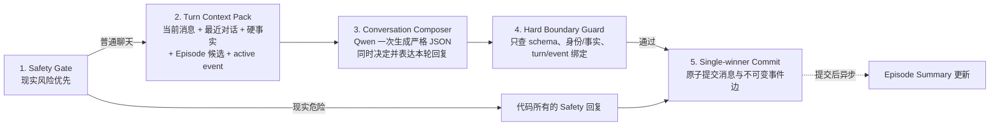

## Problem

当前普通聊天生产路径把一轮回复拆成 Context、Turn Interpretation、Dialogue State、Helping/Clinical、Response Planner、Plan Preflight、Plan Recovery、Surface、确定性 Validator、语义 Validator、same-plan regeneration 和 commit。每层都持有局部规则，多层又能拒绝候选；因此一个普通质量分歧会被逐级放大为整轮无回复。

真实反例已经证明这种复杂度不是抽象风险：用户说“最近不想上班”时，语义理解允许 `offer_emotional_support`，显式情绪证据却为空，Preflight 将局部动作缺证据升级为 `PLAN_INVALID`；补入一次 Planner Recovery 后虽然能提交回复，但跨会话 Episode Memory 又可能在前置提取/阈值处返回空候选。系统持续增加恢复分支，却没有减少相互矛盾的决策层。

目标不是再给现有链路补一个规则，而是建立唯一的 **Simplified Conversation Runtime V2**：普通路径最多五步；普通聊天自然度、是否容易接住、`accompany/explore` 表现由同一个模型在一次生成中完成，并通过离线/人工评估改进，不再成为提交前 fail-closed 硬门。

本设计只定义目标架构，不修改代码，也不批准任何固定话术、中文关键词表、新决策层或新持久状态机。

## Evidence

- `CONVERSATION_PURPOSE_CONTRACT_V1.md` 已冻结：普通聊天围绕 `accompany/explore`，证据不足默认陪伴；首次欢迎要自我介绍、说明两种对话可能并给低压力入口；这些是语义目的，不是固定话术。
- `ARCHITECTURE_V1_FINAL.md` 当前普通控制环是 Context → Interpretation → Dialogue State → Helping → Planner → ResponsePlan → Surface → Validation → State Update，且 Planner preflight recovery 与 Surface regeneration 是两套不同恢复机制。
- `conversation-reply-logic-inventory.md` 记录了至少十四类可能 hard-fail 的规则。问号、收口短语、initiative verb、普通承接、positive function、semantic provider 结构和 envelope exact equality都可能阻止一个原本可发送的普通回复。
- 同一 inventory 已记录真实冲突：`accompany/explore` 尚未成为统一运行时合同；topic initiative 的词面硬门会拒绝产品允许的自然入口；planned-function semantic gate 存在真实 false positive/false negative。
- `plan-preflight-recovery-analysis.md` 证明当前恢复只是把一个 `PLAN_INVALID` 原因送回 Planner 一次；它没有消除 Dialogue State、Planner action、positive-function contract 和 preflight 之间的重复表达。
- `.project-team/REMAINING.md` 仍有 Episode Retrieval 不稳定、Safety 第三方转述误判、首次回礼 Surface 不稳定等未决事项；继续在原链路逐项加补丁会继续增加交叉约束。

## Root Cause

根因是普通聊天被错误建模成一组必须逐层证明的计划合同，而不是一次受少量硬边界约束的语言生成：

1. 同一用户语义被 Interpretation、Dialogue State、Planner、Preflight 和 Validator 重复判断。
2. `ResponseAction`、positive-function contract、question/closure policy 和 handoff function 把自然语言质量离散成大量互相依赖的硬条件。
3. 普通质量 Validator 同时承担“督导”和“提交许可”两种角色；模型不确定、格式错误或自然表达未命中局部标准都会让整轮没有回复。
4. Planner Recovery 和 Surface Regeneration 修复的是前述复杂度造成的失败，但它们又增加新的尝试身份、冻结计划和失败分支。
5. 欢迎语和主动消息另有 selector、intent、Surface、semantic validator、内部 repair、外层 delivery recovery，重复了一套更复杂的生成系统。

真正必须 fail-closed 的边界很少：现实 Safety、结构化输出完整性、助手身份与硬事实、事件/turn 精确绑定、单 winner 与原子提交。其余“是否够自然、是否推进得好、是否真正完成某个普通聊天功能”应作为模型生成目标和质量评估，而不是运行时拒答许可。

## Proposed Solution

唯一推荐目标是 **Simplified Conversation Runtime V2**。五个产品层仍可保留为组织边界，但普通生产控制路径只保留以下五步：



### 1. Safety Gate

- Safety 保持最高优先级，命中当前现实危险时跳过普通路径，使用代码所有的安全回复并在 commit 时写 `supersedes`。
- 保留 strict structured semantic triage；已经实施、正在发生等无需判断说话主体的明确行动才可走确定性快通道，意图、引用与第三方转述交给语义分诊。
- Safety 结构或 provider 失败允许一次同输入结构修复；第二次失败为 `SAFETY_BLOCKED`，不进入普通生成。

### 2. Turn Context Pack

Context Pack 只包含：当前 User turn、有限最近 committed 对话、canonical Assistant Grounding、当前直接边界、一个严格解析的 adjacent active event，以及最多少量其他会话 Episode candidates。

- Episode retrieval 是 read-only、best-effort；失败或无候选不得阻止当前回复。
- 候选只投影 compact confirmed facts、people、topics、source ids 和明确标注的 hypothesis；不能注入整段历史。
- 不再先运行独立 Turn Interpretation model、Dialogue State activity matrix、Helping/Clinical per-turn gate 或第二套情绪词表。
- active/resolved 继续从 `opens / fulfills / supersedes` committed edges 纯查询，不写持久 lifecycle state。

### 3. Conversation Composer

由一个 Qwen **Conversation Composer** 同时完成理解、选择主要目的和自然表达；它是普通聊天唯一决策 owner，不再产生中间 `ResponsePlan`。

严格 JSON 只保留提交真正需要的数据：

```text
schemaVersion
turnId
purpose: first_contact | direct_answer | repair | respect_boundary | accompany | explore | proactive
reply
episodeRef: null | exact candidate id
groundingRefs: canonical fact ids[]
eventRef: null | exact active event id
```

`purpose` 是 turn-local trace，不是持久模式或状态机。Composer Prompt 直接携带已冻结产品目的：先处理直接回答、纠正、停止和 Safety；普通轮只取 `accompany/explore` 之一；证据不足默认陪伴；开放对话提供容易接住的内容入口；出现结束意向时不强推；不得把历史相关性写成确定因果。

不新增 action 枚举、情绪关键词、固定话术、question/closure 词表或 positive-function contract。

### 4. Hard Boundary Guard

Guard 只拥有提交安全性，不拥有聊天质量：

- strict exact-schema JSON、非空 reply、正确 `turnId`；
- Assistant 名称“小慢”、AI 身份、产品名和能力边界等 canonical hard facts；
- `episodeRef` 必须来自本轮候选，Grounding 引用必须来自 canonical ids；
- `eventRef` 必须精确绑定当前 adjacent active committed event；
- 不允许未通过候选、旧 turn 或错误 session 获得 winner authority。

Guard 不再检查问号数量、收口词、initiative verb、普通承接是否“足够”、是否完成 positive function、是否具有显式情绪 span、是否达到 `accompany/explore` 质量。普通聊天质量可以写入异步诊断 trace或人工验收，但不得阻止 commit。

Composer 共享一个总修复预算：首次输出若 schema 或硬边界不合格，系统把明确硬错误交回同一个 Composer 修正一次；第二次仍失败则结束当前 turn，不再循环。不存在 `PLAN_INVALID`、Plan Recovery 或 same-plan Surface regeneration。

### 5. Single-winner Commit

- 只有通过 Hard Boundary Guard 的一个 Assistant winner 可以提交。
- Auth 继续在同一事务内提交 Assistant message、session update、final generation authority 与 immutable envelope；Guest 保持逻辑同构的 client-scoped winner。
- 普通成功回复若精确承接 adjacent active `opens`，commit 写 `fulfills`；Safety winner 写 `supersedes`。边的 source/target 由代码绑定，不接受自由文本或 `promptVersion` 推断。
- `active/resolved` 仍由事件流纯查询；不新增 session aggregate、Memory lifecycle 字段或其他持久状态。
- commit 后异步刷新 Episode Summary。Summary 失败不回滚已提交回复，也不影响下一轮普通生成。

### Qwen 调用次数

| 场景 | 默认阻塞调用 | 最大阻塞调用 | 非阻塞调用 |
|---|---:|---:|---:|
| 普通用户 turn | Safety 1 + Composer 1 = 2 | Safety 或 Composer 各自最多一次结构/硬边界修复；单边界最大 2、整轮理论最大 4 | commit 后 Episode Summary 0 或 1 |
| 明确可观察的 imminent Safety 快通道 | 0 | 0 | Summary 0 或 1 |
| 首次欢迎 / 回访主动消息 | Composer 1 | 同一总预算内最多 2 | commit 后 Summary 0 或 1 |
| Episode retrieval | 0 | 0 | 0 |

迁移完成后不再调用独立 Turn Interpretation Qwen、Surface Qwen、planned-function semantic Validator Qwen 或 proactive semantic Validator Qwen。若要进一步收敛最大调用数，可在实现阶段规定 Safety 与 Composer 各自修复只在 malformed JSON 时触发；不能为了减少调用放宽 hard boundary。

### 失败语义

| 失败 | 处理 |
|---|---|
| 当前现实危险 | Safety 覆盖普通路径并提交 Safety winner |
| Safety 两次仍无法形成合法决定 | `SAFETY_BLOCKED`；本 turn 结束，会话与输入框继续可用 |
| Composer/provider/strict JSON 两次失败 | `GENERATION_FAILED`；没有 Assistant event，显示系统侧失败，不要求用户重复“重新生成”同一逻辑 |
| 身份、硬事实、turn/event 绑定两次仍冲突 | `HARD_BOUNDARY_BLOCKED`；没有 Assistant event，不降级为假聊天 fallback |
| Episode retrieval/summary 失败 | 降级为无跨会话记忆继续聊；当前回复不失败 |
| 普通聊天质量不佳 | 仍提交；进入诊断与人工回归，不产生 fail-closed 状态 |
| 原子提交失败 | `PERSISTENCE_ERROR`，不返回未提交 winner，可安全重试同一 turn id |

“结束”始终只结束当前 turn execution，不结束 session，不写持久失败状态；下一条 User 消息创建新的 turn。

### 首次欢迎、主动消息与跨会话记忆

- **首次欢迎**：使用同一个 Composer，`purpose=first_contact`；Context Pack 注入 canonical “小慢 / AI 聊天助手”硬事实与首次接触产品目的。身份错误由 Hard Guard 阻止；自我介绍、两种对话可能和低压力入口通过冻结 Prompt、真实 Qwen 回归和人工体验验收保证，不再由 semantic quality gate 拒绝整条欢迎。
- **主动消息**：沿用现有 committed-event/时间配置计算是否 due；用户活跃时不连续插入，且不得出现 Assistant 连发。due 后仍使用同一个 Composer，成功时写一个 `opens`。不再保留独立 intent → Surface → semantic validator → internal repair → outer recovery 链。
- **跨会话记忆**：每个 committed 会话异步生成 append-only Episode Summary；新 turn 直接用当前原文检索少量候选，Composer 可选零或一条。无候选、检索超时或 summary 失败都不影响生成。历史事实与 hypothesis 保持类型分离，相关性只能作为表达材料，不能由 Memory 直接决定回复。

### 退出生产关键路径的现有层

以下组件可以保留为离线评估、迁移对照或 legacy trace reader，但不再拥有用户可见 commit authority：

- 独立 Turn Interpretation model 与 relation candidate arbitration；
- Dialogue State 的 activity/initiative/repair planning matrix；
- 每 turn Helping/Clinical applicability、Rogers/Hill shadow 对普通回复的同步前置；
- Response Planner action matrix、`ResponsePlan`、question/closure policy；
- Plan Preflight 与 Plan Preflight Recovery；
- 独立 Surface Realization；
- ordinary acknowledgement、topic initiative、closure、question-count 等词面 Validator；
- positive-function / handoff semantic quality Validator；
- same-plan regeneration；
- proactive selector/intent/Surface/semantic-validator/内外两层 recovery。

仍保留在生产边界：Safety、bounded Context、canonical Grounding、strict structured output、Hard Boundary Guard、Episode Memory、turn/session winner authority、Auth 原子事务、Guest 逻辑同构提交、不可变 `opens/fulfills/supersedes` 事件边及其纯查询。

### 迁移顺序

1. **冻结 V2 合同与回放集**：以真实失败轮、首次欢迎、名字连续性、直接回答、结束意向、Safety、主动消息和跨会话记忆组成验收集；明确只有 Safety/硬事实/结构/authority/commit 可以阻止回复。
2. **Shadow Composer**：V2 读取现有 Context/Memory，在当前 V1 旁路生成 strict JSON，但零 commit、零事件写入；比较真实 Qwen 输出、调用次数和普通回复可发送率。V1 仍是唯一 writer。
3. **普通 turn 单 writer 切换**：按本地/小流量 flag 让 V2 成为唯一 commit path；不得把 V1 Validators 串在 V2 后面。保留 V1 只读 trace 用于对照。
4. **欢迎与主动消息合流**：首次欢迎和 return proactive 统一进入 Composer；保留 due/dedupe 与 immutable `opens`，移除独立 proactive 生成/质量 gate/recovery 链。
5. **退役关键路径并更新权威文档**：删除生产调用，不必立即删除 legacy/eval 文件；更新 Architecture、Purpose implementation mapping 与发布门。确认真实 Qwen、单 winner、Safety/identity/fact、Episode Memory、事件纯查询和人工“愿意回下一句/自我理解增量”验收后再 Git seal。

迁移期间任一时刻只能有一个 commit writer；Shadow 结果永远不能写 Assistant、event edge、Memory lifecycle 或 session state。

## Files To Change

本分析阶段只新增：

- `docs/tasks/simplified-conversation-runtime-v2-analysis.md`

后续授权实现时，按迁移阶段最小修改：

- `services/ai/chatOrchestrationService.ts`：收敛为五步 orchestration，并确保 V1/V2 只有一个 writer。
- 新建或重用一个 Conversation Composer 边界：承载 exact-schema Qwen 调用；不要复制 Planner/Surface 两个 owner。
- `services/ai/chatSafety.ts`：保留独立 Safety contract，不扩张关键词表。
- `conversation-os/control/contextAssembly.ts`：投影 V2 bounded Context Pack、canonical facts、active event 与少量 Episode candidates。
- `conversation-os/control/assistantGrounding.ts`：继续作为身份与产品硬事实单一来源。
- `conversation-os/interactionMoveEnvelope.ts`：保留 strict parser、immutable edges 和 pure active/resolved query；收敛 ordinary fulfill 的 code binding。
- `services/memory/episodeSummaryService.ts`：保留异步 summary 与 best-effort retrieval，确保失败不进入普通 reply failure。
- `services/ai/chatReplyService.ts` 与 Guest/Auth API：保留 turn authority、single winner 与原子/逻辑同构 commit。
- proactive greeting service/API：只保留 due/dedupe/commit，生成合流到 Composer。
- 现有 Planner、Preflight、Surface 与 ordinary semantic/deterministic quality validators：移出 production imports，保留为迁移期离线对照后再决定删除。
- 架构、Purpose implementation mapping、专项回放脚本：同步 V2 authority 与新验收边界。

## Risks

- 单 Composer 减少了控制层，但也把更多自然语言判断交给模型；必须用真实会话回放、盲评和线上诊断守质量，不能重新把诊断变成 commit hard gate。
- 只保留硬边界后，偶尔可能提交不够自然、太浅或推进不佳的回复；这是可观察并可迭代的质量缺陷，优先级低于整轮无回复和规则死循环。
- Hard Boundary Guard 若继续使用宽中文 regex，会以新名字复活旧 Validator；它只能验证 canonical ids、exact bindings、已存在 Grounding 与 schema，不得扩张普通语言词表。
- Composer 的 `purpose`、`episodeRef` 和 `eventRef` 若被写入会话状态，会重新形成 lifecycle state；它们只能存在于单 turn trace和 immutable committed event metadata。
- 将 ordinary `fulfills` 改为 code-derived binding前，必须冻结“成功承接 adjacent active move即消费该 handoff”的 V2 事件语义；不得静默沿用当前 positive-function Validator 的完成定义。
- Episode retrieval 目前有真实不稳定证据；V2 必须让它 best-effort，避免再次阻断回复，但迁移验收仍需验证相关历史能在足够多的真实场景中被选中。
- 首次欢迎不再由质量 semantic gate fail-closed 后，可能出现“欢迎成功显示但三功能表达不够完整”；发布前以真实 Qwen回归和人工体验门解决，不能用固定欢迎文案兜底。
- Shadow/flag 迁移若让 V1 和 V2 同时提交，会破坏单 winner和事件边；所有阶段必须只有一个 writer，shadow 永远只读。
